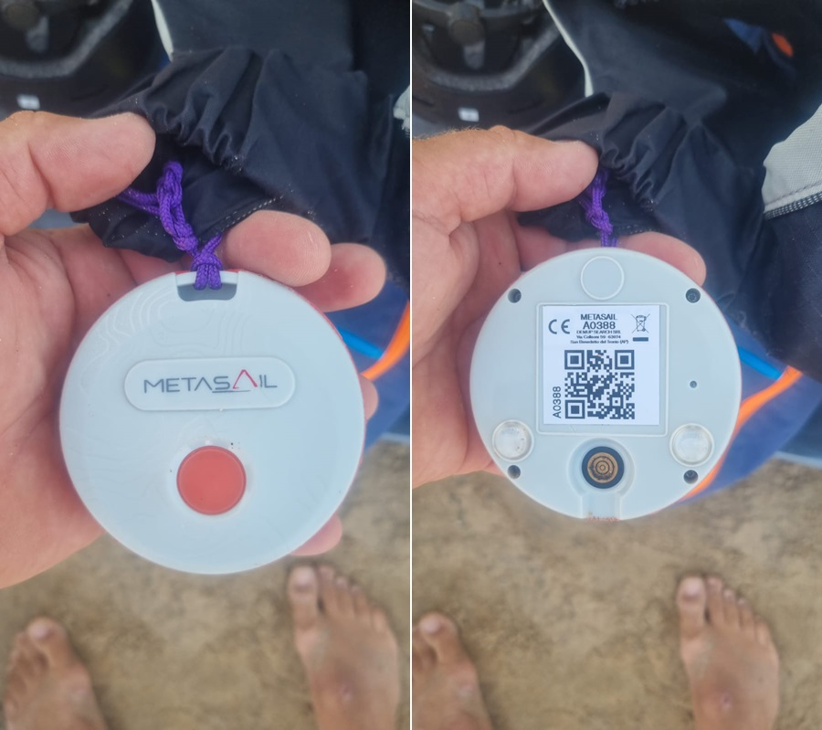
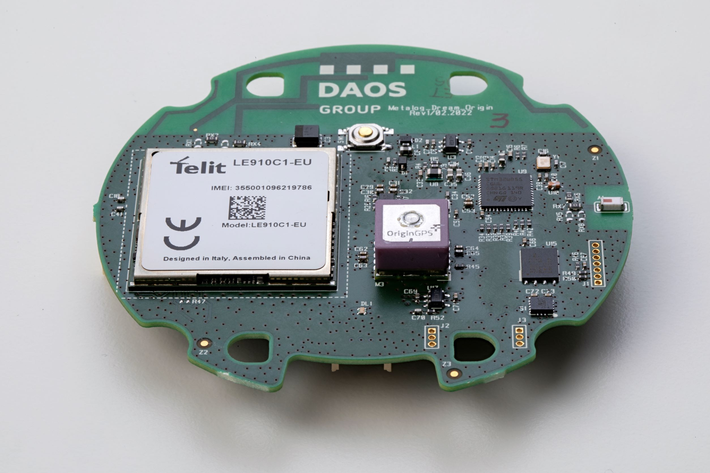

## Metasail

Author: Michael George

Created: 1 August 2024

### Overview

[Metasail.com](https://www.metasail.com/) is currently being used by the PWA in Fuerteventura and you can [watch / replay](https://www.metasail.com/live/597/) all of the PWA races.

It has also been used for the one hour classic in Torbole in [2019](https://www.metasail.com/past/116) + [2020](https://www.metasail.com/past/147) + [2021](https://www.metasail.com/past/188) + [2022](https://www.metasail.com/past/308) + [2023](https://www.metasail.com/past/416) + [2024](https://www.metasail.com/past/557/) - see thread on [seabreeze.com.au](https://www.seabreeze.com.au/forums/Windsurfing/Gps/Foil-beats-fin-speed#2766768).

After a little bit of research, I've concluded the Metasail GPS tracker uses the Telit [LE910C1](https://www.telit.com/devices/le910cx-linux/) module which is based on the Qualcomm MDM9215.

The Qualcomm MDM9215 is actually quite an old product because it appears in a Qualcomm press releases from [Feb 2012](https://www.qualcomm.com/news/releases/2012/02/qualcomm-announces-fifth-generation-embedded-data-connectivity-reference) and [Sep 2012](https://investor.qualcomm.com/news-events/press-releases/detail/317/qualcomm-second-generation-lte-chipsets-enable-high-speed).

### Internals

The internals of the Metasail are shown in a 2021 case history on the [Daos Group](https://www.daosgroup.it/en/casehistory/metasail-dream/#) website.

The photo of the PCB provides some useful information about the components:

- Daos Group - Metalog_Dream_Origin Rev1/02.2022

- Telit [LE910C1](https://www.telit.com/devices/le910cx-linux/) is clearly visible

### Telit LE910C1

A [case study](https://www.telit.com/resources/case-studies/metasail-high-seas-meet-high-accuracy/) on the Telit website says the following:

> Meteda’s engineering team built the MetaSail devices around Telit’s [GPS module](https://www.telit.com/modules-overview/positioning-timing-modules/) and xE866 family of cellular modules, designing a compatible antenna and physical structure.

The Telit LE910C1 [product page](https://www.telit.com/devices/le910cx-linux/) lists the following GNSS functionality:

> Simultaneous support of GPS, Glonass, Beidou, Galileo, QZSS

The Telit LE910 software user guides list the NMEA sentences supported, including GNSS range residuals (GRS):

- [Rev. 10 – 2021-06-04](https://sixfab.com/wp-content/uploads/2021/09/Telit_LE910Cx_Software_User_Guide_r10.pdf)
- [Rev. 7 – 2020-09-25](https://sixfab.com/wp-content/uploads/2021/02/Telit_LE910Cx_Software_User_Guide_r7.pdf)

The Telit LE910Cx application note describes the use of $GPSNMUN, $GPSNMUNEX and $GPSACP:

- [LE910Cx/ME910C1/ML865C1/NE910C1  A-GPS Application Note](https://sixfab.com/wp-content/uploads/2021/02/Telit_LE910Cx_ME910C1_ML865C1_NE910C1_A-GPS_Application_Note_r2.pdf)

There are various references to Qualcomm in the software user guides and $GPSNMUN + $GPSNMUNEX + $GPSACP are for Qualcomm.

### GNSS Chipset

The Telit [press release](https://www.telit.com/press/telit-expands-its-qualcomm-technologies-based-portfolio-with-new-lte-concept-product/) from 2013 includes the following details:

>  The LE910, based on Qualcomm Technologies’ Gobi™ MDM9215.

The Telit LE910C1 seems very likely to be based on the Qualcomm MDM9215, based on the above statement.

See the [4G LTE Portfolio](https://www.telit.com/modules-overview/cellular-lte/) on the Telit website for all LE910 products; LE910Q1, LE910Cx (Linux),  LE910Cx (ThreadX), and LE910R1.

#### Red Herrings

We can ignore the fact that Telit have used the Airoha AG3335 chipsets in their recent GNSS modules:

- [Telit Cinterion Adds New Dual-Band GNSS Positioning Modules Featuring the AIROHA AG3335 Chipset Family](https://www.telit.com/press/telit-cinterion-adds-new-dual-band-gnss-positioning-modules-featuring-airoha-ag3335-chipset-family/) - 15 Mar 2023
- [Telit SE873K5 GNSS Receiver Brings Compact Form Factor and Advanced Power Modes](https://www.telit.com/press/telit-se873k5-gnss-receiver-brings-compact-form-factor-and-advanced-power-modes/) - 16 Jun 2022

The LE910Cx software user guide describes the GRS message as one of the NMEA outputs, which rules out Mediatek / Airoha chipsets:

- GRS is not supported Mediatek / Airoha chipsets. I've not seen it mentioned in any technical documentation of GNSS modules, etc.
- GRS suggests a chipset that implements Receiver Autonomous Integrity Monitoring (RAIM).

### Qualcomm MDM9215

The [press release](https://www.telit.com/press/telit-expands-its-qualcomm-technologies-based-portfolio-with-new-lte-concept-product/) from 2013 describes how the Telit LE910 is based on the Qualcomm MDM9215.

- I cannot find an official page for the Qualcomm MDM9215, but the [MDM9205S](https://www.qualcomm.com/products/technology/modems/9205s-modem) page includes GNSS capabilities
    - Satellite Systems: GLONASS, Galileo, Beidou, GPS.
- A press release from [Sep 2013](https://www.qualcomm.com/news/releases/2012/09/qualcomm-second-generation-lte-chipsets-enable-high-speed-wireless) implies the MDM9215 is the successor to the MDM9205:
    - The MDM9215 is the second generation 4G/LTE product, and first to feature a MDM9x15 chipset built on the 28nm.

- The list of snapdragon models on [Wikipedia](https://en.wikipedia.org/wiki/List_of_Qualcomm_Snapdragon_modems#Qualcomm_Gobi) lists the MDM9200 + MDM9215 alongside the MDM9600 + MDM9615:
    - The MDM9615 Snapdragon X5 LTE Modem (IZat gpsOneGen 8A) was used in the iPhone 5 (released Sep 2012).

- The Telit LE910C1 software manuals describe the Qualcomm serial protocol, $GPSNMUNEX (including GRS) and $GPSACP:
  - [Rev. 10 – 2021-06-04](https://sixfab.com/wp-content/uploads/2021/09/Telit_LE910Cx_Software_User_Guide_r10.pdf)
  - [Rev. 7 – 2020-09-25](https://sixfab.com/wp-content/uploads/2021/02/Telit_LE910Cx_Software_User_Guide_r7.pdf)
- $GPSNMUN and $GPSNMUNEX are described in the application note for the Telit LE910Cx:
    - [LE910Cx/ME910C1/ML865C1/NE910C1  A-GPS Application Note](https://sixfab.com/wp-content/uploads/2021/02/Telit_LE910Cx_ME910C1_ML865C1_NE910C1_A-GPS_Application_Note_r2.pdf)
- $GPSNMUNEX is quite similar to $GPSNMUN, described in more detail on M2M support:
    - [AT$GPSNMUN AT command is used to activate unsolicited streaming of GPS data](https://m2msupport.net/m2msupport/atgpsnmun-unsolicited-nmea-data-configuration/)
- $GPSACP also provides a mechanism to retrieve the following details:
    - `<UTC>,<latitude>,<longitude>,<hdop>,<altitude>,<fix>,<cog>, <spkm>,<spkn>,<date>,<nsat_gps>,<nsat_glonass>`

Some websites detailing the Qualcomm 9215 and the GNSS capabilities:

- [Qualcomm MDM9215 LTE 4G Wireless Communication Module MC7330 For Japan](https://www.wirelesscommunicationmodule.com/sale-7563061-qualcomm-mdm9215-lte-4g-wireless-communication-module-mc7330-for-japan.html)
    - "GNSS - GPS + GLONASS."
    - n.b. GPS + GLONASS is consistent with the [Daos Group](https://www.daosgroup.it/en/casehistory/metasail-dream/#) website which says GPS + GLONASS.
- [Compact multi band LTE modules](https://www.texim-europe.com/news/238-Compact-multi-band-LTE-modules)
    - Ultra compact multi band LTE module which is based on the Qualcomm MDM9215.
    - This complete multi-band TDD-LTE/FDD-LTE/WCDMA/GSM/GNSS SMT.

### Conclusion

I've concluded the Metasail GPS tracker uses the Telit [LE910C1](https://www.telit.com/devices/le910cx-linux/) module which is based on the Qualcomm MDM9215.

The Qualcomm MDM9215 is actually quite an old product because it appears in a Qualcomm press releases from [Feb 2012](https://www.qualcomm.com/news/releases/2012/02/qualcomm-announces-fifth-generation-embedded-data-connectivity-reference) and [Sep 2012](https://investor.qualcomm.com/news-events/press-releases/detail/317/qualcomm-second-generation-lte-chipsets-enable-high-speed).
