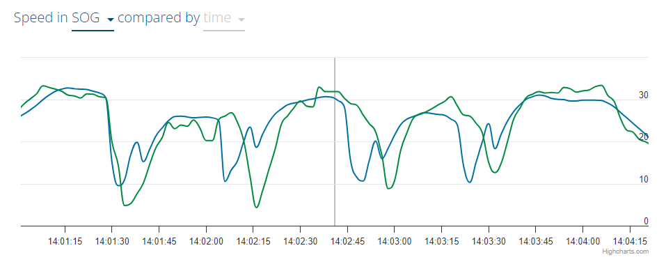

## Telit LE910C1

Author: Michael George

Created: 8 August 2024

### Observations

#### Airoha

Weird speeds from Matteo (blue) during periods of acceleration look like the Airoha chipset, or past issue of Garmin / COROS.

Race link - https://app.metasail.it/(S(sedvdlugur5dncdagpz4iyo3))/ViewRecordedRace2022.aspx?idgara=32233&token=1CKA

Perhaps newer versions of the LE910C1 use an Airoha chip?

Press releases about Telit Cinterion and Airoha:

- [Telit Cinterion Adds New Dual-Band GNSS Positioning Modules Featuring the AIROHA AG3335 Chipset Family](https://www.telit.com/press/telit-cinterion-adds-new-dual-band-gnss-positioning-modules-featuring-airoha-ag3335-chipset-family/) - Mar 2023
  - SE868K5 family of dual-band GNSS positioning modules

#### Speed Accuracy

It is also noticeable that speed accuracy is shown by Metasail, but the origin of it is unknown.

### Reference

- [LE910Cx/ME910C1/ML865C1/NE910C1  A-GPS Application Note](https://sixfab.com/wp-content/uploads/2021/02/Telit_LE910Cx_ME910C1_ML865C1_NE910C1_A-GPS_Application_Note_r2.pdf) - see AT$GPSACP

### AT commands

- [LE910Cx AT Command Reference](https://sixfab.com/wp-content/uploads/2021/02/Telit_LE910Cx_AT_Command_Reference_r9.pdf) - 80502ST10950A Rev.9.0 - 2020-09-25
  - LE910Cx-EU lists AT$GPSQOS in section 4.1
  - 5.6.13.3. Get Acquired Position - $GPSACP
  - 5.6.13.12. GPS Quality of Service - $GPSQOS 
  - 5.6.13.36. Get Current Location - $GETLOCATION includes HEPE 
  - 5.6.13.38. GNSS Navigation Update Rate Configuration - $GPSNHZ (default = 1000 ms)

#### AT$GPSQOS

Page on [Techship](https://techship.com/support/faq/basic-gnss-gps-usage-for-telit-lm960a18-cellular-module/) describes AT$GPSQOS for the LM960A18

> You can change the GPS quality of service (QoS). This is done by the AT command AT$GPSQOS. To see what curren QoS parameters that are set enter AT$GPSQOS? and to see the supported values enter AT$GPSQOS=?. For exemple you can enter the following to get low horizontal and vertical accuracy and a low response time. This is greatly further explained in chapter 5.6.2.9 in the AT commands guide.
> AT$GPSQOS=1800000,990,150,0,0,0
>
> For further explanations of the AT commands look at chapter 5.6.2 in the AT command guide, found under "Technical Documentation" on the product page https://techship.com/products/telit-lm960a18-lte-cat-18-mpcie/
