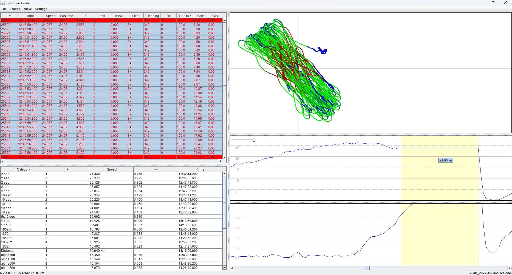
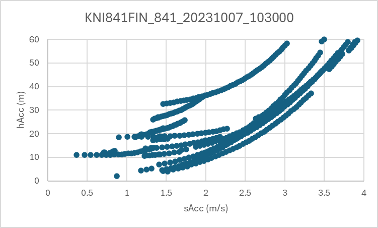

## Motion Mini

### Fix Type

#### Background

The following screenshot is taken from a wingfoiling session at Brogborough Lake on 26 October 2022. It nicely illustrates what happens when the u-blox GNSS chipset loses its lock on the satellites after a sudden crash.

Essentially the u-blox chipset reports the speed over ground (SOG) and course over ground (COG) as constant, and reports position changes using linear extrapolation. During the outage, speed accuracy (sAcc) and horizontal accuracy (hAcc) increase slowly over time.

After a windsurfing crash it is very common for GNSS receivers to lose their lock on the satellite signals, just moments before the rider comes to a dead stop. It is very misleading to report a constant SOG / COG and report changes of position whilst the satellite signals are not being tracked.

#### Observations

It is very easy to identify the affected data points because their fix type has a value of "0", meaning "no fix". This is in contrast to a fix type of "3" which is a 3D fix and to be expected when the satellite signals are being tracked.

When a "no fix" navigation solution is produced by the u-blox chipset it has the following properties:

- SOG and COG remain constant
- Position is updated using linear extrapolation
- Sats = 0
- HDOP = 99.99
- hAcc and sAcc slowly increase over time

Whilst this behavior makes a lot of sense for motor vehicles (and many other use cases) it is highly undesirable for watersports.

The following chart shows the relationship between hAcc and sAcc when the fix type is "0", showing how they rise in unison, albeit at different rates.

#### Recommendation

The Locosys GT-11 used to have a logging option called "ON-FIX", which was recommended to most users. It probably makes sense to implement the same approach within the Motion and any other GNSS loggers using u-blox chipsets, certainly for watersports.

There does not seem to be any benefit to logging the "no fix" navigation solutions during watersports activities. They are generally misleading and likely to lead to confusion amongst users, even if the phantom speeds are handled by the standard software filters.

It should be very easy to implement this approach in the Motion and numerous other loggers (e.g. ESP-GPS). It can perhaps be made user configurable (if desired), but ensuring the default setting is "ON-FIX" and not "ALWAYS".

#### Additional Note

UBX-CFG-NAV5 describes a parameter called drLimit which seems likely to be responsible for the "no fix" behavior:

>  Reserved (maximum time to perform dead reckoning (linear extrapolation) in case of GPS signal loss

The description "dead reckoning (linear extrapolation)" matches the observed "no fix" navigation solutions perfectly.

