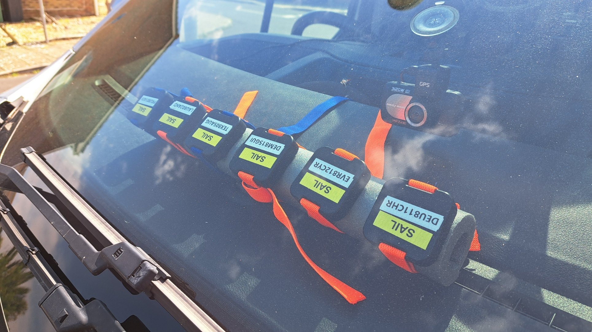
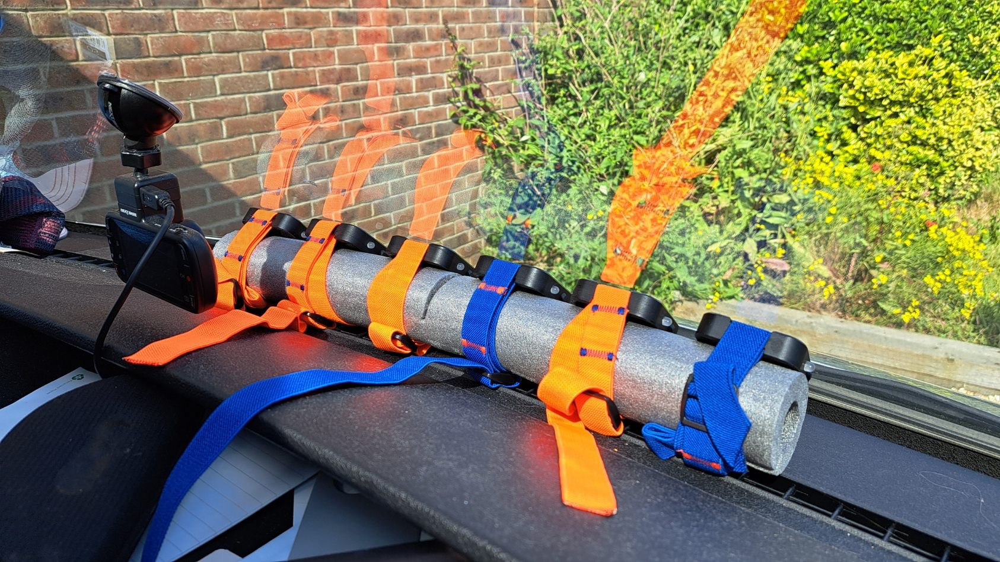
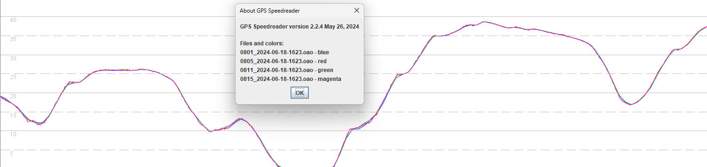
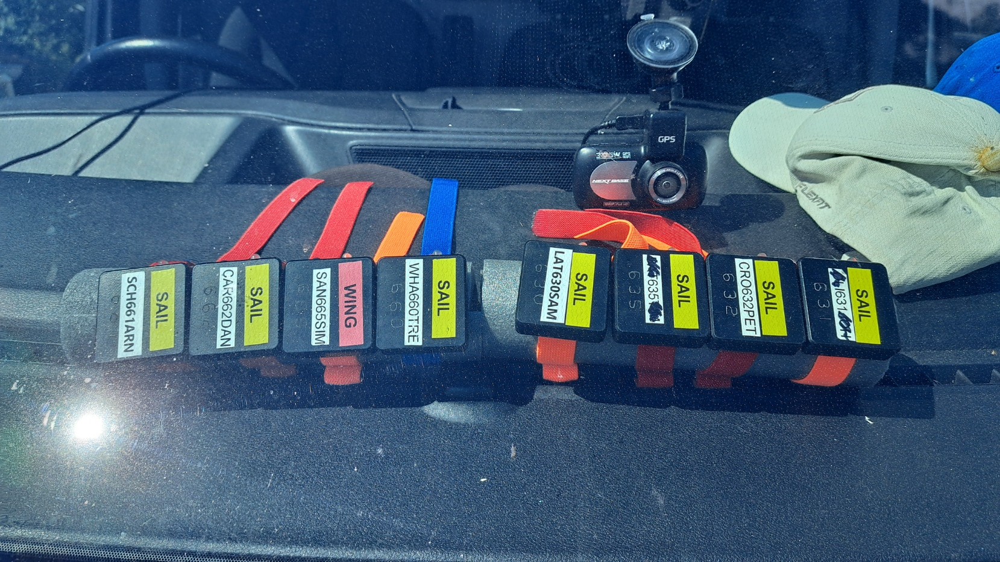
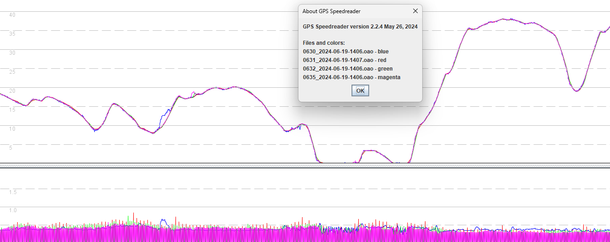

## Motion Mini - Rate Investigation

### Driving Tests

#### Overview

The driving tests facilitate the comparison of different logging rates, subject to relatively smooth acceleration and deceleration. The route was repeated a number of times and there was an emphasis on driving smoothly, attempting to keep [jerk](https://en.wikipedia.org/wiki/Jerk_(physics)) to a minimum.

The purpose of this particular test was to determine if there is any difference in behavior between motions logging at 1 / 2 / 5 / 10 Hz. It is interesting to note that to all intents and purposes the differences between 1 / 2 / 5 / 10 Hz are minimal and all of them can produce good results.

#### Installation

The motions were attached to some pipe lagging with identical orientations and wedged between the dashboard / windscreen.

Prior to driving the motions were given a minimum of a 15 minute warm up, allowing for signal acquisition and enough time to acquire the ephemerides.

#### Data

All of the data is available for download in OAO format:

- [2024-06-18-van.rar](2024-06-18-van.rar) - newer motions logging @ 1 / 2 / 5 Hz
- [2024-06-19-van.rar](2024-06-19-van.rar) - older motions logging @ 1 / 2 / 5 / 10 Hz

#### Day 1

Testing on 18 June used the newer style mini motions, logging at 1 / 2 / 5 Hz.

The last digit of the serial numbers indicates the logging rates and the motions were arranged as seen in the previous image:

A visual inspection of the 1 Hz (blue and green) and 5 Hz (red and magenta) data in GPS Speedreader shows slightly less detail in the 1 Hz data, when a change in acceleration occurs.

It is possible to compare various combinations of the 1 / 2 / 5 Hz data but it is evident that all of the logging rates generally produce very similar results.

#### Day 2

Testing on 19 June used the older style mini motions, logging at 1 / 2 / 5 / 10 Hz.

The last digit of the serial numbers indicates the logging rates and the motions were arranged as seen in the previous image:

A visual inspection in GPS Speedreader shows that the 1 / 2 / 5 / 10 Hz data is very similar (as per the previous test), but both 10 Hz devices exhibited some errors. The screenshot below shows one such error from the 10 Hz device in blue.

It is possible to compare various combinations of the 1 / 2 / 5 / 10 Hz data but it is pretty clear that they all produce very similar results.

Details of some apparent errors in the 10 Hz data:

- 14:15:17 and 14:20:21 for motion 630.
- 14:03:43 and 14:23:12 for motion 660.
- Both motion 630 and 660 were logging at 10 Hz, which may (or may not) be a coincidence.
- All of the errors listed above are accompanied by slight increases in sAcc.

#### Conclusions

The basic conclusions are as follows:

- Activities that do not see sudden changes in acceleration (jerk) may be accurately captured, even with 1 Hz logging.
- Higher logging rates such as 5 Hz do however manage to capture sudden changes in acceleration - aka jerk.
- 10 Hz logging will be more prone to background noise and may also be more prone to errors as described earlier.

