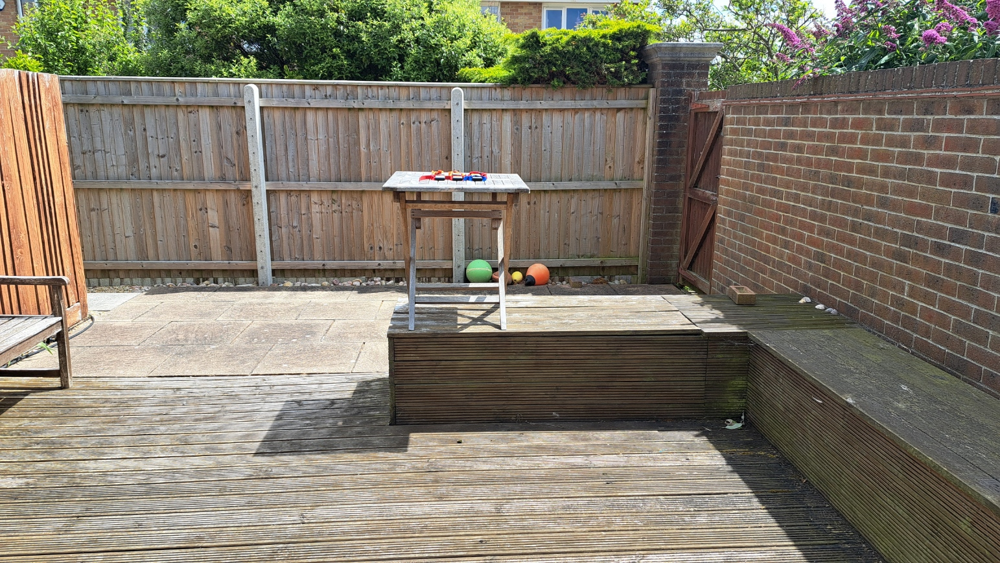
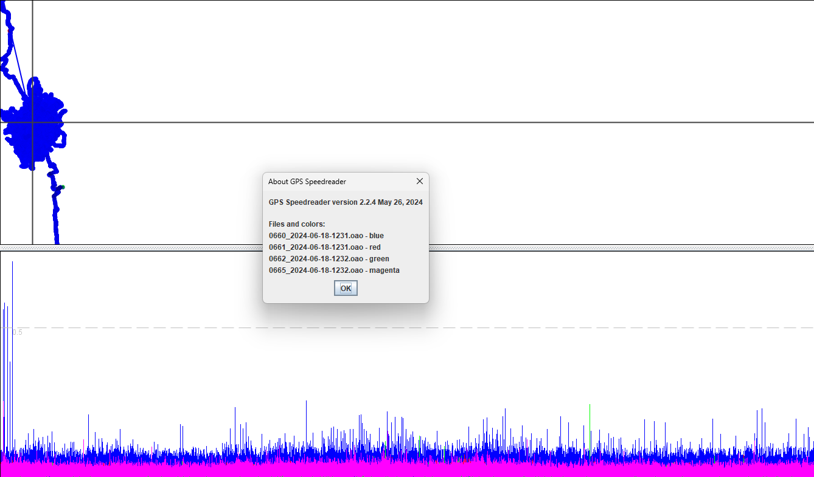
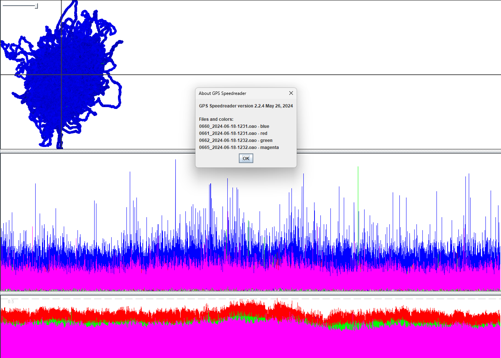
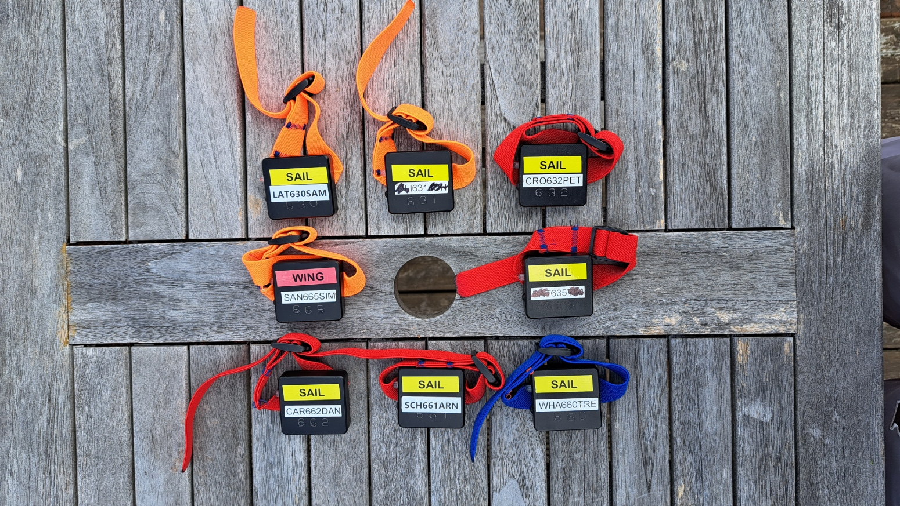
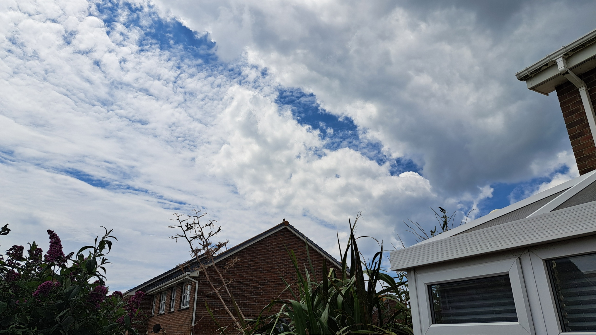
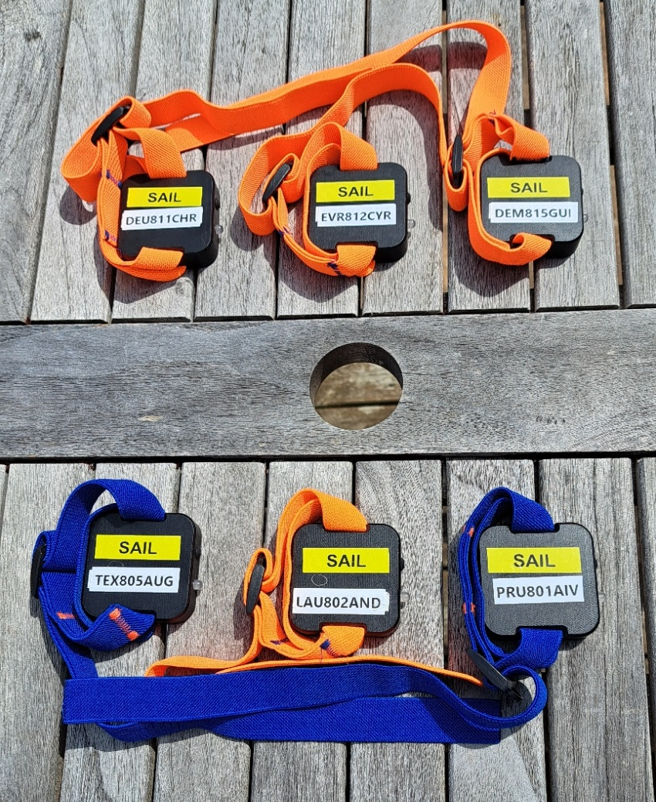

## Motion Mini - Rate Investigation

### Static Tests

#### Overview

The general concept behind static testing is that the GNSS receivers are in constant motion (due to the rotation of the earth), but speed over ground (SOG) is known to be zero. Any speed reported by the receiver is therefore an error and may be considered as noise.

The purpose of this particular test was to determine if there is any difference in behavior between motions logging at 1 / 2 / 5 / 10 Hz. It is clear from the results that higher logging rates do indeed suffer from greater levels of noise, and may be prone to larger outliers.

#### Environment

The tests were performed on calm days, within the security of a garden where the motions could be left unattended for approximately 6 hours.

The motions were placed on a raised table to minimize the effects of a nearby wall, but otherwise a pretty decent open-sky environment.

Once the test was underway the motions were left untouched, right until the end of the test when they were switched into WiFi mode.

#### Data

All of the data is available for download in OAO format:

- [2024-06-18-garden.rar](2024-06-18-garden.rar) - older motions logging @ 1 / 2 / 5 / 10 Hz
- [2024-06-19-garden.rar](2024-06-19-garden.rar) - newer motions logging @ 1 / 2 / 5 Hz

It is important to top and tail the data, prior to analysis:

- Delete the first 15 minutes which should be regarded as the warm up, allowing for acquisition of the ephemerides.
- Delete the last 2 minutes which is likely to include movement whilst switching the motions into WiFi mode.

#### Warm Up

The significance of a 15 minute warm up period is apparent after loading the data for 660, 661, 662 and 665 into GPS Speedreader:

After removing the first 15 minutes of data the wander and > 0.5 knot spikes are completely eliminated, leaving the majority of data for the analysis:

#### Day 1

Testing on 18 June used the older style mini motions, logging at 1 / 2 / 5 / 10 Hz.

The test was intended to run for 6 hours but was actually stopped after 5 hours 20 minutes, thus providing slightly over 5 hours worth of useful data.

The last digit of the serial numbers indicates the logging rates and the motions were arranged as follows:

There was some cloud cover, but no rain was to be expected during the day. View to north, prior to testing:

View to south, prior to testing:

Visual inspection of the 5 hours of data in GPS Speedreader provides the following insights:

- 10 Hz data contains the most noise and the largest outliers.
- 5 Hz data exhibits less noise (and smaller outliers) than the 10 Hz data, but higher levels of noise than the 1 Hz and 2 Hz data.
- 2 Hz data exhibits less noise than the 1 Hz data which is slightly curious, but possibly due to the devices themselves.
- 1 hour speeds and total distances can be used as a proxy for the noise levels.

A Python script within [GPS Wizard](https://github.com/Logiqx/gps-wizard) generated the following statistics, using knots as units:

| Motion | Rate (Hz) | Max   | Median  | Mean    | StdDev  |
| :----: | :-------: | ----: | ------: | ------: | ------: |
| 631    | 1         | 0.109 | 0.01555 | 0.01650 | 0.00976 |
| 661    | 1         | 0.080 | 0.01361 | 0.01422 | 0.00839 |
| 632    | 2         | 0.194 | 0.01361 | 0.01481 | 0.00903 |
| 662    | 2         | 0.243 | 0.01166 | 0.01221 | 0.00739 |
| 635    | 5         | 0.134 | 0.01944 | 0.02223 | 0.01247 |
| 665    | 5         | 0.156 | 0.01944 | 0.02020 | 0.01132 |
| 630    | 10        | 0.309 | 0.03499 | 0.03731 | 0.02120 |
| 660    | 10        | 0.257 | 0.02916 | 0.03184 | 0.01787 |

Observations for these statistics:

- The max readings are single outliers and are only provided for informational purposes.
  - However, it might be worth noting that the 1 Hz data contains the smallest spikes.

- The median, mean and standard deviation clearly show the following in terms of errors / noise:
  - Noise in 10 Hz > 5 Hz > 2 Hz.
    - 2 Hz to 5 Hz results in circa 50% more noise.
    - 5 Hz to 10 Hz results in circa 50% more noise.
  - Noise in 10 Hz > 5 Hz > 1 Hz.
  - Differences between 2 Hz and 1 Hz may not have any statistical significance, and are possibly due to the actual devices.
- Interestingly, despite the higher logging rates exhibiting more noise, sAcc claims the exact opposite.
  - Interpretation of sAcc may not be fully understood for different logging rates, yet.

#### Day 2

Testing on 19 June used the newer style mini motions, logging at 1 / 2 / 5 Hz. It's not currently possible to configure them for 10 Hz.

The test was run for around 6 hours 20 minutes, providing over 6 hours worth of actual data, after excluding the warm up period.

The last digit of the serial numbers indicates the logging rates and they were arranged as follows:

The first 15 minutes should be regarded as the warm up, allowing for complete acquisition of the ephemerides. Much like the data from the previous day there is a fair amount of wander during the first 15 minutes, most likely due to use of the almanac data which is less precise than the ephemeris data. This is quite apparent when loading the data for motions 811 / 812 / 815 into GPS Speedreader.

Visual inspection of the remaining 6 hours of data in GPS Speedreader provides the following insights:

- 5 Hz data exhibits higher levels of noise than the 2 Hz and 1 Hz data.
- 2 Hz data exhibits slightly more noise than the 1 Hz data.
- 1 hour speeds and total distances can be used as a proxy for the noise levels.

A Python script within [GPS Wizard](https://github.com/Logiqx/gps-wizard) generated the following statistics, using knots as units:

| Motion | Rate (Hz) | Max   | Median  | Mean    | StdDev  |
| :----: | :-------: | ----: | ------: | ------: | ------: |
| 801    | 1         | 0.105 | 0.00972 | 0.01026 | 0.00661 |
| 811    | 1         | 0.091 | 0.00972 | 0.01134 | 0.00740 |
| 802    | 2         | 0.235 | 0.00972 | 0.01194 | 0.00822 |
| 812    | 2         | 0.354 | 0.00972 | 0.01242 | 0.00862 |
| 805    | 5         | 0.130 | 0.01749 | 0.01827 | 0.01063 |
| 815    | 5         | 0.381 | 0.01555 | 0.01794 | 0.01039 |

Observations for these statistics:

- The max readings are single outliers and are only provided for informational purposes.
  - However, it might be worth noting that the 1 Hz data contains the smallest spikes.
- The median clearly show the following in terms of errors / noise:
  - Noise in 5 Hz > 2 Hz.
  - Noise in 5 Hz > 1 Hz.
- The mean and standard deviation clearly show the following in terms of errors / noise:
  - Noise in 5 Hz > 2 Hz > 1 Hz.
    - 2 Hz to 5 Hz results in circa 50% more noise in terms of the mean.
  - Noise in 2 Hz is only slightly higher than 1 Hz and may not have any statistical significance.
- Interestingly, despite the higher logging rates exhibiting more noise, sAcc claims the exact opposite.
  - Interpretation of sAcc may not be fully understood for different logging rates, yet.

#### Conclusions

The basic conclusions are as follows:

- Allowing for 15 minutes warm up / acquisition of the ephemerides should be factored into all static testing.
- Higher logging rates are prone to higher levels of noise.
  - 2 Hz to 5 Hz results in circa 50% more noise.
  - 5 Hz to 10 Hz results in circa 50% more noise.
  - Suspect 20 Hz would exhibit more noise than 10 Hz.
- Further analysis might look into why sAcc is higher for the lower logging rates, which are actually less noisy!

The following caveats should also be listed:

- Static testing does not involve acceleration or jerk, so the Kalman filter will not be subjected to acceleration, or jerky motion.
- Course over ground (COG) is locked at low speeds, which is not true when speed over ground (SOG) exceeds a specific threshold.
- Errors / noise will always be positive during static testing, whereas errors / noise will be a mix of + or - when SOG is greater than zero.

#### Future Ideas

It might be worth testing the statistical significance of differences in the 1 Hz and 2 Hz data:

- Levene's test (compare variances) - see [Wikipedia](https://en.wikipedia.org/wiki/Levene%27s_test) and [scipy](https://docs.scipy.org/doc/scipy/reference/generated/scipy.stats.levene.html)
- Welch's t-test (compare means) - see [Wikipedia](https://en.wikipedia.org/wiki/Welch%27s_t-test) and [scipy](https://docs.scipy.org/doc/scipy/reference/generated/scipy.stats.ttest_ind.html)
