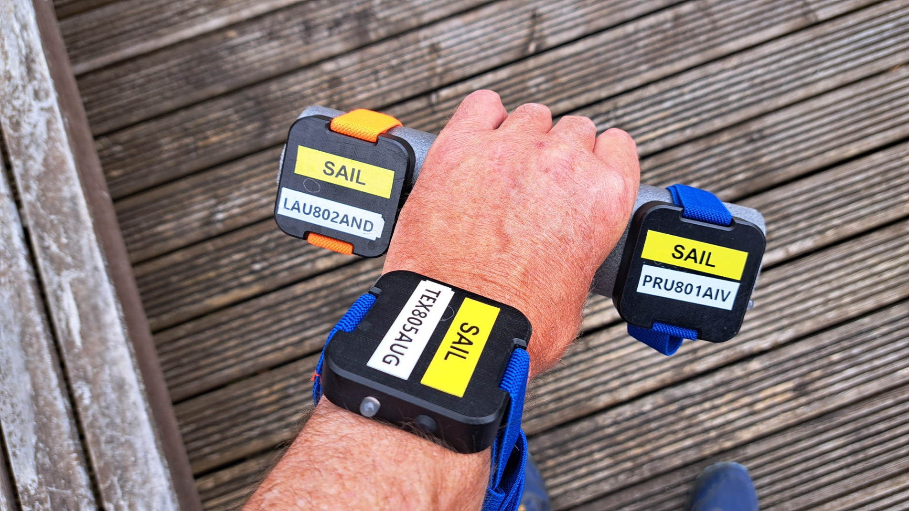
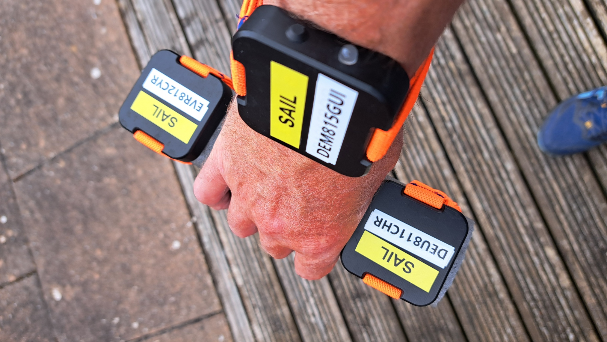
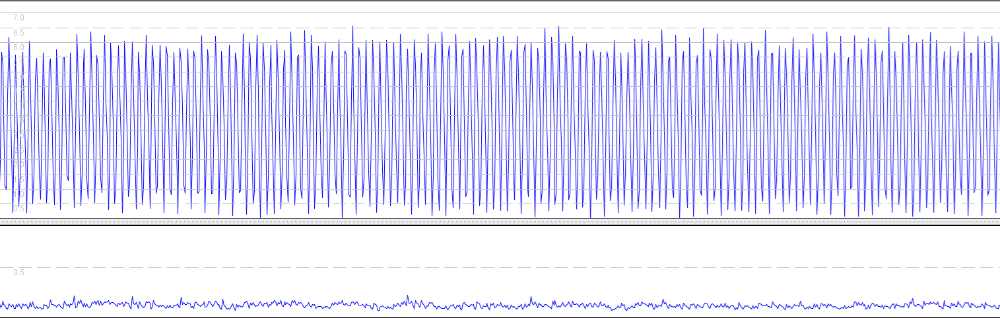
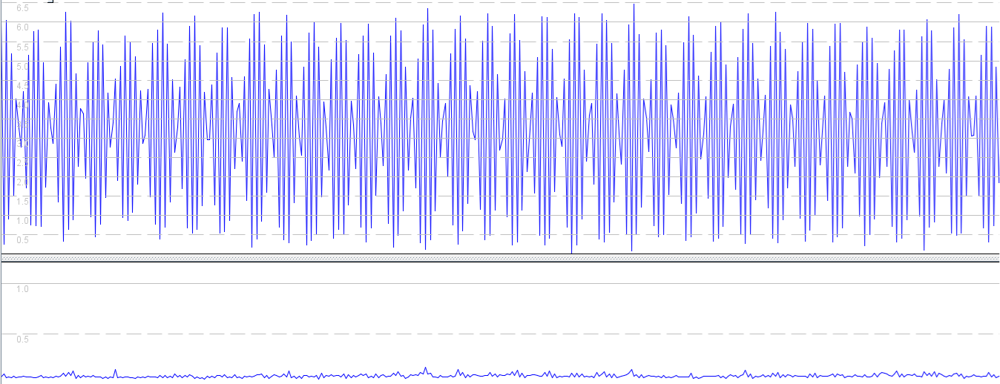
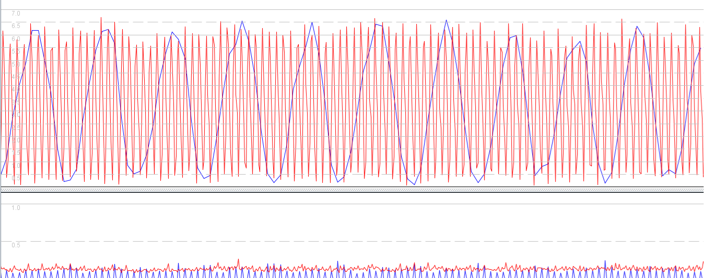
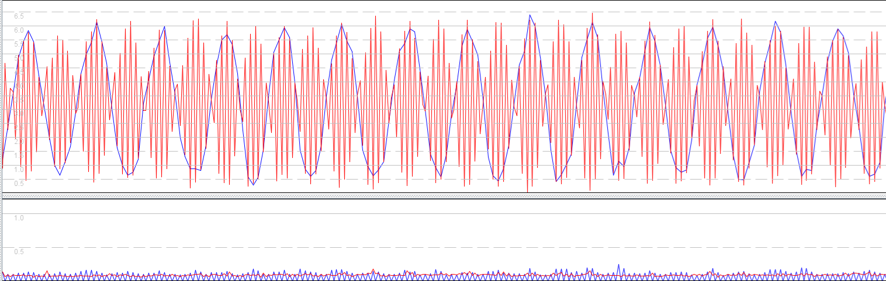
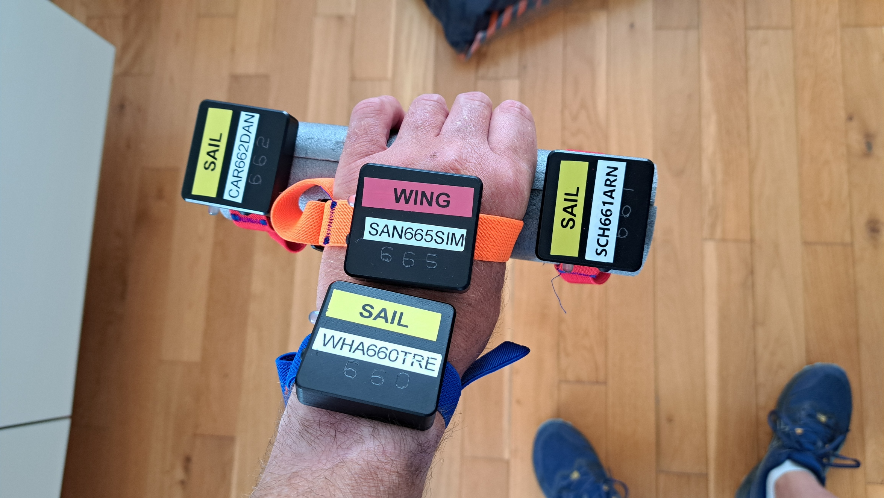
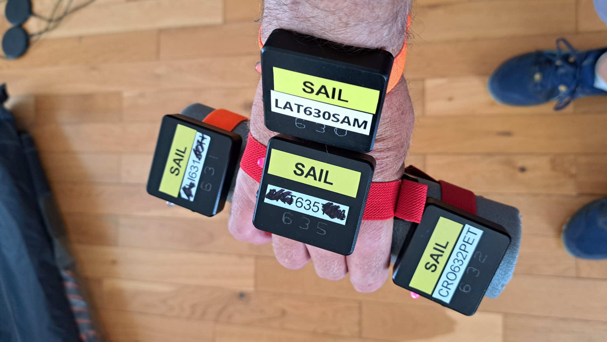
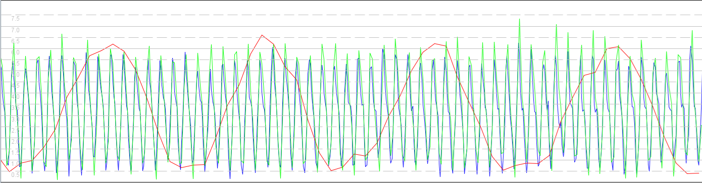
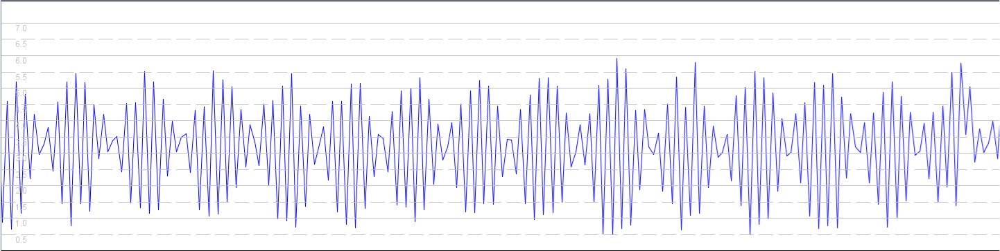

## Motion Mini - Rate Investigation

### Walking Tests

#### Overview

The walking tests are intended to provide insight into the capture of changes to acceleration and deceleration (aja jerk), due to swinging of the arms. The chosen route is an excellent open-sky environment and the walk itself contained periods both with and without arm movement.

The purpose of this particular test was to determine if there is any difference in behavior between motions logging at 1 / 2 / 5 / 10 Hz. Perhaps the most interesting observation is that walking provides an excellent real-world illustration of the [Nyquist-Shannon](https://en.wikipedia.org/wiki/Nyquist%E2%80%93Shannon_sampling_theorem) sampling theorem.

#### Warm Up

Prior to testing the motions were given a minimum of a 15 minute warm up, allowing for signal acquisition and enough time to acquire the ephemerides.

#### Data

All of the data is available for download in OAO format:

- [2024-06-18-walk.rar](2024-06-18-walk.rar) - newer motions logging @ 1 / 2 / 5 Hz
- [2024-06-19-walk.rar](2024-06-19-walk.rar) - older motions logging @ 1 / 2 / 5 / 10 Hz

#### Day 1

Testing on 18 June used the newer style mini motions, logging at 1 / 2 / 5 Hz.

The last digit of the serial numbers indicates the logging rates and the motions.

The motions were held such that 1 Hz and 2 Hz would experience identical acceleration / deceleration. Left hand:

Right hand:

Viewing the 5 Hz data in GPS Speedreader clearly shows the effect of swinging the arms:

The 2 Hz data does capture the cadence of the arm swings correctly, but shows an interesting beating:

The 1 Hz data shows a completely different cadence to the 5 Hz data, with a period of around 10 seconds.

Comparing the 1 Hz and 2 Hz data there is a clear relationship:

The artefacts in the 1 Hz and 2 Hz data are referred to as aliasing and relate to the [Nyquist-Shannon](https://en.wikipedia.org/wiki/Nyquist%E2%80%93Shannon_sampling_theorem) sampling theorem.

A walker / runner is unlikely to be interested in measuring their arm speed, but this does illustrate why a higher logging rate can be important.

If you want to record accurate speed data for jerky motion, then you must choose a suitable logging frequency.

My original working notes were as follows:

- Arm swings captured by 5 Hz
- Nyquist observations
  - Beating apparent in 2Hz
  - Misleading sinusoid in 1Hz data

- GPX files for 1 Hz and 2 Hz have near identical sinusoids
  - True for both hands, but perhaps a little better for 801 and 802

#### Day 2

Testing on 19 June used the older style mini motions, logging at 1 / 2 / 5 / 10 Hz.

The last digit of the serial numbers indicates the logging rates and the motions.

The motions were held such that 1 Hz, 2 Hz and 5 Hz would experience near-identical acceleration / deceleration. Left hand:

Right hand:

Comparing the 1 Hz (red), 5 Hz (green), and 10 Hz (blue) data it can be seen that the higher logging rates tell much the same story:

It is worth noting that you might expect a slightly smaller range of speeds in the 10 Hz data (green), due to where it was being worn in relation to the other devices.

As per the first test the 1 Hz data is a sinusoid but this time with a period of around 15 seconds. A slightly different cadence has changed the period in the 1 Hz data.

The 2 Hz data exhibits a beating effect, just like in the original test:

So it would appear that the 5 Hz and 10 Hz data captures the true nature of the walking, but 2 Hz and 1 Hz are very misleading.

My original working notes were as follows:

- Note that 10 Hz should not be expected to be moving quite as fast as 5 Hz, due to wrist mounting
- 0631 vs 0635 demonstrates 5 Hz noise in steady walk. 1 Hz seems better?
- 5 Hz and 10 Hz data almost identical during steady walk
  - Some slightly unrealistic artefacts in 0660 during mid-swing?
  - Good to compare 5 + 10 + 1, or 5 + 10 + 2, or 2 + 1
- 630 seems a little iffy during arm swinging - max speed too low, but min sped ok?
  - 660 and 665 seems the best bet when comparing against 1 Hz and 2 Hz
- 1 Hz data can be very misleading - sinusoidal trace of arm swinging
- 2s and 10s speeds from 1 Hz data are a nonsense!
  - Need to use 250m or 500m to get closer to the truth

- 2 Hz data is better than 1 Hz, although it does exhibit beating
- Note the identical beating in positional and doppler speeds of the 2 Hz track
  - The two types of speed are also very similar in the 1 Hz data with it's long sinusoid

#### Conclusions

The basic conclusions are as follows:

- If you want to record accurate speed data for jerky motion, then you must choose a suitable logging frequency.
- 5 Hz works well for this specific activity, but other scenarios may necessitate a higher frequency.
- Higher frequencies aren't always necessary. e.g. 1 Hz appears to be fine for car journeys without jerky motion.

#### Todo

- Test GW-60 in 5 Hz and 1 Hz modes during walking to see if similar aliasing is evident in 1 Hz data
  - Previous testing suggested slightly dampened hand speeds from the GW-60 - perhaps attenuated by the Kalman?
  - Forerunner 255 data also contains a hint of aliasing - see 15601197246_ACTIVITY (bike) and 15601243271_ACTIVITY (other)

#### References

- Mention of Nyquist on Seabreeze - [link](https://www.seabreeze.com.au/forums/Windsurfing/Gps/Speed-Accuracy?page=5#2731952)
- Thread about "beating" on DSP Stack Exchange - [link](https://dsp.stackexchange.com/questions/10398/aliasing-beating-frequency)
