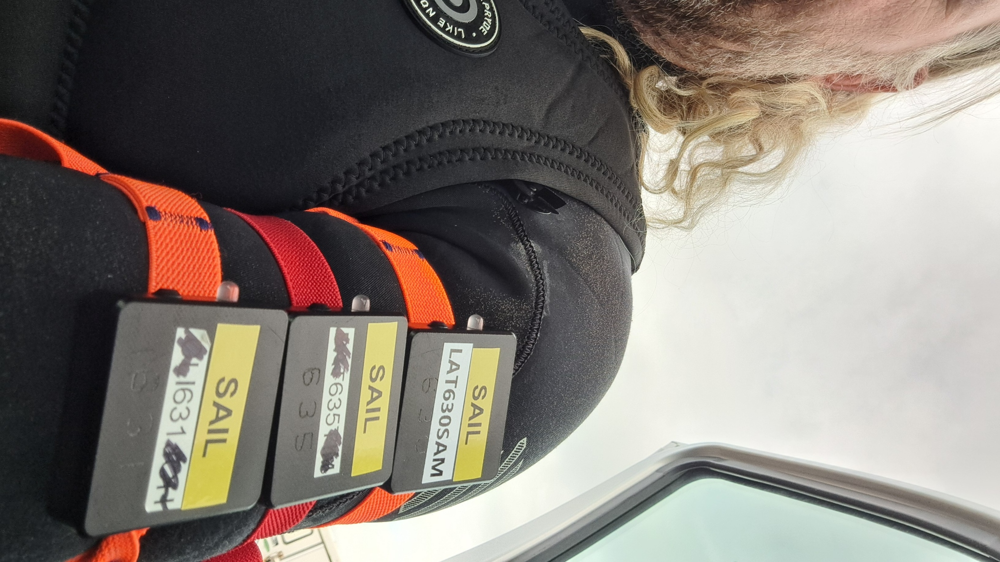
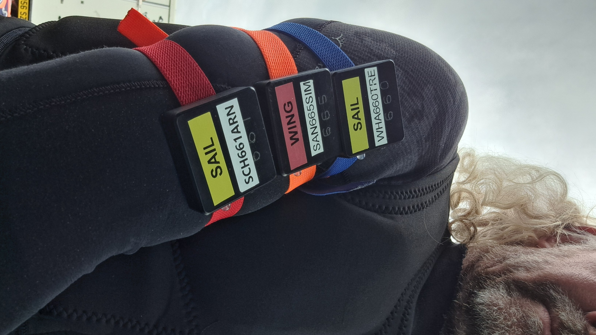
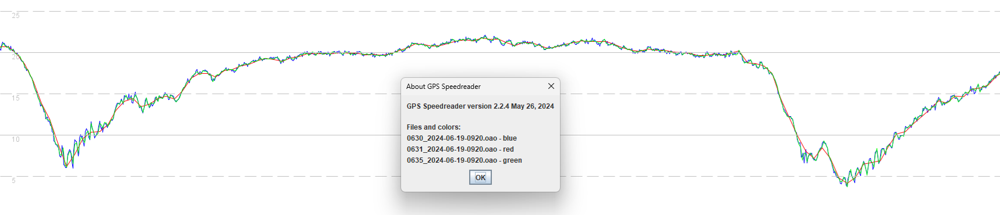
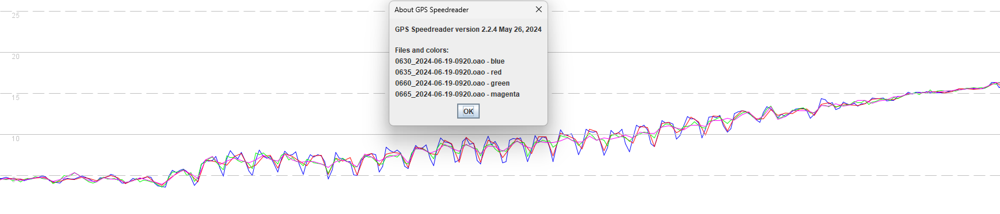
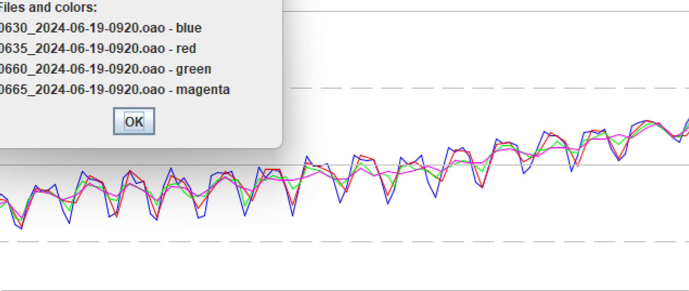
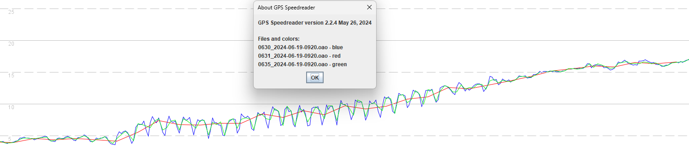

## Motion Mini - Rate Investigation

### Windfoiling Tests

#### Overview

The windfoiling tests are intended to provide insight into the capture of changes to acceleration and deceleration (aka jerk), due to pumping and other factors. The test session was on a day with very light winds, so there was a lot of pumping required to get up onto the foil.

The purpose of this particular test was to identify any differences in behavior between motions logging at 1 / 5 / 10 Hz. It is clear from the data that there are insights to be gleaned from the 5 Hz and 10 Hz data, not relating to board speed per-se but including factors such as arm motion.

#### Warm Up

Prior to testing the motions were not given the usual 15 minute warm up, but probably just about enough time to acquire the ephemerides which take between 12 and 12.5 minutes to be received in full.

#### Data

All of the data is available for download in OAO format:

- [2024-06-19-windfoil.rar](2024-06-19-windfoil.rar) - older motions logging @ 1 / 5 / 10 Hz

#### Testing

Testing on 19 June used the newer older mini motions, logging at 1 / 5 / 10 Hz.

The last digit of the serial numbers indicates the logging rates and the motions.

Three motions were worn on each arm. Left arm:

Right arm:

Viewing the left arm 1 / 5 / 10 Hz data in GPS Speedreader it can be seen that the 5 Hz and 10 Hz data contain details not present in the 1 Hz data:

The 1 Hz data does a pretty good job of showing what may well be the approximate board speed, but it does not contain any of the pumping detail.

Comparing the 5 Hz and 10 Hz data from both arms shows a strong correlation between the devices on the same arm. For example, blue (10 Hz) + red (5 Hz) on left arm, versus green  (10 Hz) + magenta (5 Hz) on right arm:

The differences are quite subtle but beneath the dialog box, blue + red appear to consistently vary in speed by more than green and magenta:

This leads me to believe that the movements being captured are real, and the differences between each arm when pumping are clearly evident. It should however be noted that the higher logging rates will also be prone to greater levels of noise, as demonstrated by the static testing.

When looking at this same period for just the left arm, it can be seen that the 5 Hz (green) and 10 Hz (blue) data are recording details that are absent in the 1 Hz data (red).

The 1 Hz data well may however be a good approximation of the actual board speed, and thus suitable for speed sailing. After all, much as a runner is unlikely to be interested in their rapidly changing arm speeds, speed sailors should not really be reporting their bodily movements.

It should be mentioned that there (theoretically) a risk that 1 Hz aliasing may also occur when pumping with a specific cadence, much akin to the artefacts seen when swinging the arms during a walk.

To summarize, if you want to record accurate speed data for jerky motion, then you must choose a suitable logging frequency.

Since the 5 Hz and 10 Hz data tell the much same story and are somewhat immune to the aliasing during the walking tests, it makes sense to choose a higher logging rate such as 5 Hz when speed sailing, IMHO.

It is also worth mentioning the insignificance of individual speed measurements when logging at higher frequencies such as 5 Hz and 10 Hz:

- Look at 09:09:09 in this data for extreme changes in 5 Hz data - repeatedly >2 knots change in 0.2 seconds.
  - This is unlikely to represent a genuine change in board speed, simply arm movements when pumping!
- Individual "max" speeds in 5 Hz and 10 Hz data are also prone to greater levels of random noise.
  - The maximum 2s within 5 Hz and 10 Hz data is probably a good proxy of the true vMax, not individual readings.

#### Conclusions

The basic conclusions are as follows:

- If you want to record accurate speed data for jerky motion, then you must choose a suitable logging frequency.
  - 5 Hz appears to work well for windsurfing and windfoiling and faithfully captures arm movements.
  - 5 Hz and 10 Hz are also more prone to random noise, which was clearly evident during the static testing.

- Individual readings calling themselves "max" speed should not be taken literally, since they are not just the board speed.
  - The maximum 2s within 5 Hz and 10 Hz data is probably a good proxy of the true vMax, not individual readings.

#### Todo

Future sessions might look to perform the following tests:

- Wear 1 Hz + 2 Hz + 5 Hz devices on both arms to see if the 2 Hz data is also missing the details present in 5 Hz / 10 Hz data.
- Attach 10 Hz devices to the back foot straps, hopefully providing some insight into whether 5 Hz / 10 Hz data includes arm movements.
  - This may be particularly clear during periods of sustained flight on the foil, when the board speed feels relatively constant.
