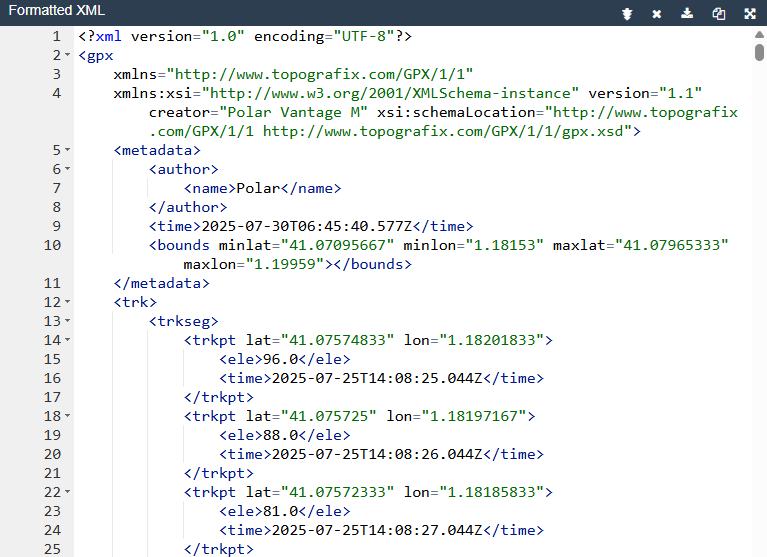
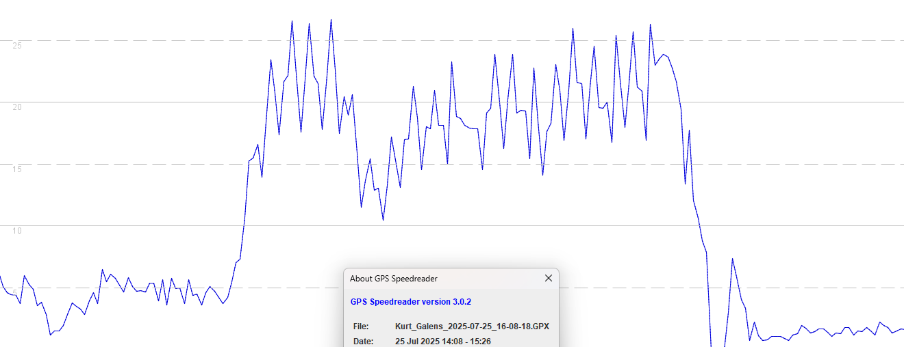
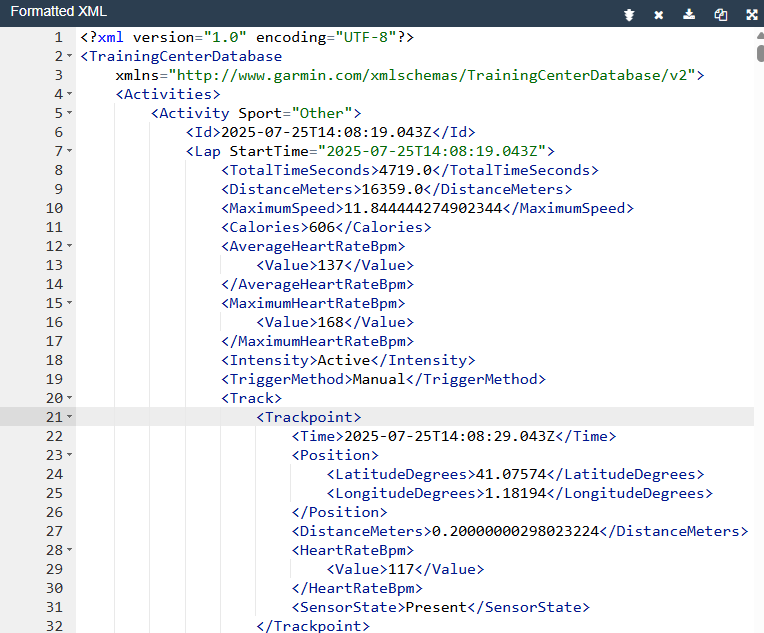
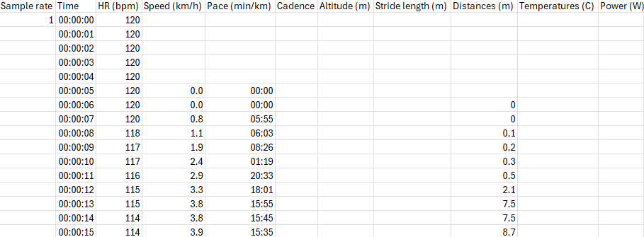
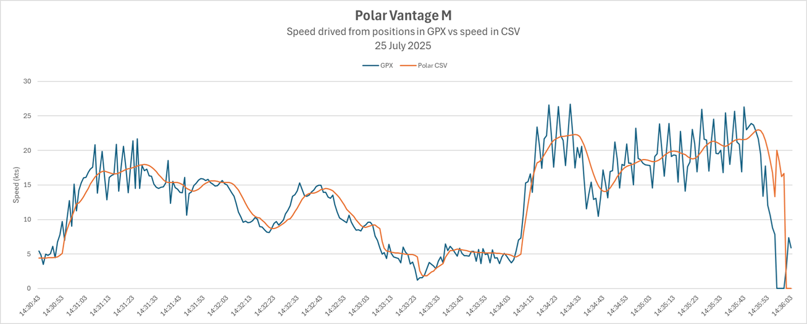
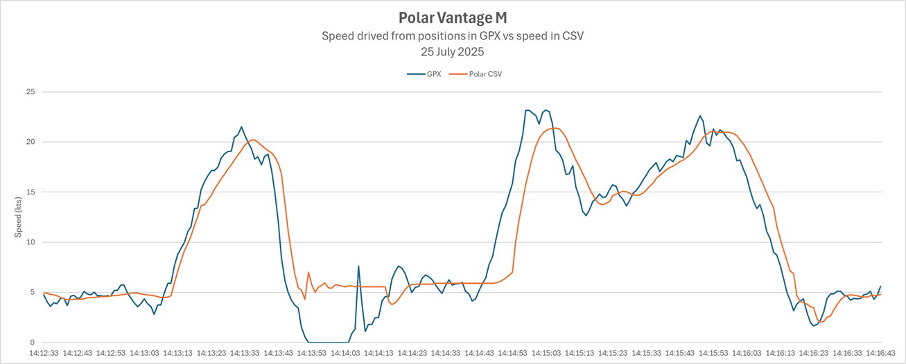
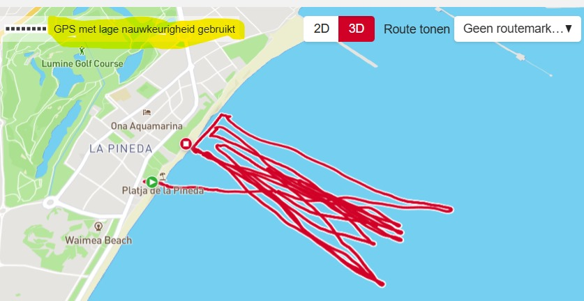

## Polar Vantage M

Author: Michael George

Created: 30 Jul 2025

### Introduction

The Vantage M was released in Feb 2019 and used the Sony GNSS chipset which was popular at the time. Polar watches offer several watersports modes, including windsurfing. Until now, I've not had access to any Polar data so have not had any insights into their suitability for watersports.

This is a very quick look at windsurfing data from the Polar Vantage M.

### Data Exports

Polar offers three different export options - GPX, TCX and CSV. There is no FIT export like Garmin, COROS and Suunto.

#### GPX

The GPX file does not contain anything besides latitude, longitude and elevation.

It is notable that there are several periods during the session where position-derived speeds are extremely noisy.

This kind of noise in the positional data is reminiscent of other watches that use the same Sony GNSS chipset, such as the Garmin Instinct 2.

#### TCX

The TCX adds heartrate to latitude and longitude but does not include speed.

#### CSV

The CSV does not include latitude and longitude. but it does include the speed in kph (limited to 1 decimal place).

### Comparison of GPX and CSV

Comparison of the GPX and CSV shows there are some clear differences, such as the speed data in the CSV being less noisy.

Zoomed in the speed data looks unusually smooth and slightly lagged, meaning that Polar are doing some filtering / smoothing.

Besides the smoothing there is something odd about the speed in the CSV. The rider stopped during the first run (to adjust equipment). This is evident in speeds derived from the positional data but the speed in the CSV hovers around 6 kts in a way that looks quite unrealistic.

The rider said that he did his first run out to sea but felt the sail trim was not correct, so headed back to the beach. When he arrived the speed on his watch was still showing 25 kts whilst standing still. The speed displayed by the watch dropped down to 0 kts after a few seconds.

### Filtering / Smoothing

My suspicion is that Polar are simply smoothing speeds that have been derived from latitude and longitude data. This will mean that big spikes in the positional data will also trickle into the speeds seen on the watch itself. Conversely, genuine high speeds are likely to be under-reported and low speeds during gybes will be over-reported.

### Accuracy

In the Polar app there is a "GPS with low accuracy used" message. The watch might have been paying attention to signal reception throughout the session via measures such as fix type, HDOP, num sats, C/N0 etc.

The watch was set as GPS+GLONASS but GPS+Galileo is likely to be a better choice nowadays. However, this won't be a silver-bullet that fixes the other issues which relate to software-design decisions.

### Discussion

The lack of a FIT or GPX file containing position and speed data makes analysis tricky for the regular user.

Aside from that the absence of the raw Doppler-derived speed data is problematic. There are some fairly unique traits that can be seen in the speed data from the Sony GNSS chipset and they are not present in the CSV. It seems very likely that Polar are simply filtering / smoothing the positional data to determine speed. Under normal circumstances smoothing will under-estimate the max speeds (undesirable for the rider) and over-estimate the min speeds (affecting gybe analysis). Use of positional data will mean that large spikes in max speed are common (especially with the Sony GNSS chipset), despite the filtering / smoothing that has been implemented by Polar.

More recent Polar watches have probably replaced the Sony GNSS chipset with something from another manufacturer (e.g. Airoha). This will likely improve the data quality but it is highly likely that the same general approach will be used by Polar... ignoring the Doppler-derived speed and using the positional data. This is not a desirable approach for people wanting reasonably accurate / reliable speeds when windsurfing, kitesurfing, wingfoiling, etc. Polar need to capture the Doppler-derived speeds and record them in their GPX export before their watches become suitable for watersports users who care about their speed data.

### References

The following links all refer to the Polar M using a Sony GNSS chipset.

- [Comparison of various watch GPS quality](https://www.reddit.com/r/Strava/comments/16favmj/comparison_of_various_watch_gps_quality/) - r/Strava, Sep 2023
  - Watch comparison includes Suunto Vantage M in addition to various Garmin watches
- [GPS Accuracy Issue Impacted Garmin, Suunto, and Polar Watches Over Past Week](https://www.dcrainmaker.com/2022/07/accuracy-impacted-watches.html) - DC Rainmaker, Jul 2022
  - Lists Polar Vantage Series, Grit Series, and Pacer Series Watches
- [New 2021 GPS Accuracy Issue Impacting Some Garmin, Suunto, other GPS Devices](https://www.dcrainmaker.com/2021/01/accuracy-impacting-devices.html) - DC Rainmaker, Jan 2021
  - Lists Polar Vantage V/M/V2, Grit X, Ignite
