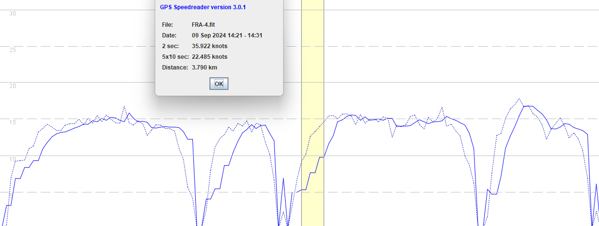

## Suunto 9 Peak Pro

Author: Michael George

Created: 11 Feb 2025

### Introduction

This is a very quick look at the data from the Suunto 9 Peak Pro.

The watch uses a Sony GNSS chipset, according to [actionhub](https://www.actionhub.com/reviews/2023/01/09/suunto-9-peak-pro-review-optimizing-off-grid-adventure/) and [DC Rainmaker](https://www.dcrainmaker.com/2022/11/suunto9-depth-review.html).

### Overview

The following screenshot serves as an overview of the data from the Suunto 9 Peak Pro.

Whilst the timing issues of the [Ambit3](../ambit3/README.md) are not evident, things that stand out are as follows

- Speeds are sometimes repeated, evident by the "steps" which have been highlighted.
  - This is completely normal on watches using a Sony GNSS chipset, and affects COROS + Garmin as well.

- Speeds are shifted to the right, suggesting additional filtering / smoothing.
  - They are aligned with the position-derived speeds prior to a run and after a run.

### Summary

This is not an in-depth review of the Suunto 9 Peak Pro, simply a quick glimpse at the data.

Initial impressions suggest that it is not looking any more closely at the Peak Pro for speed sailing, or any other Suunto watches from the same era.
