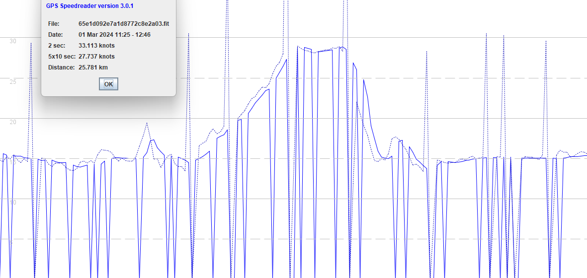
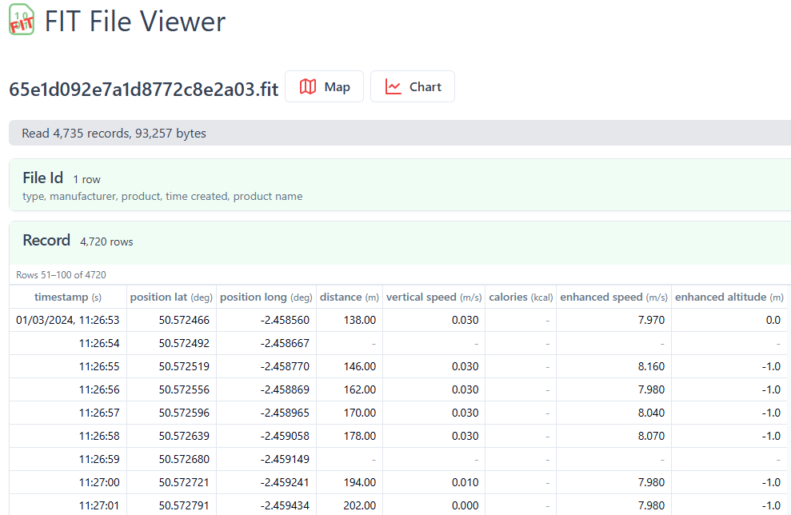
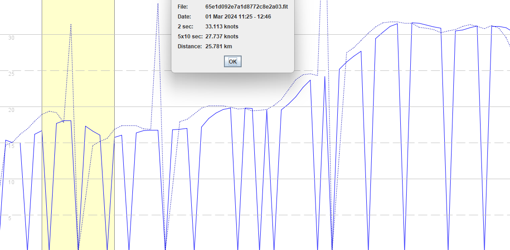
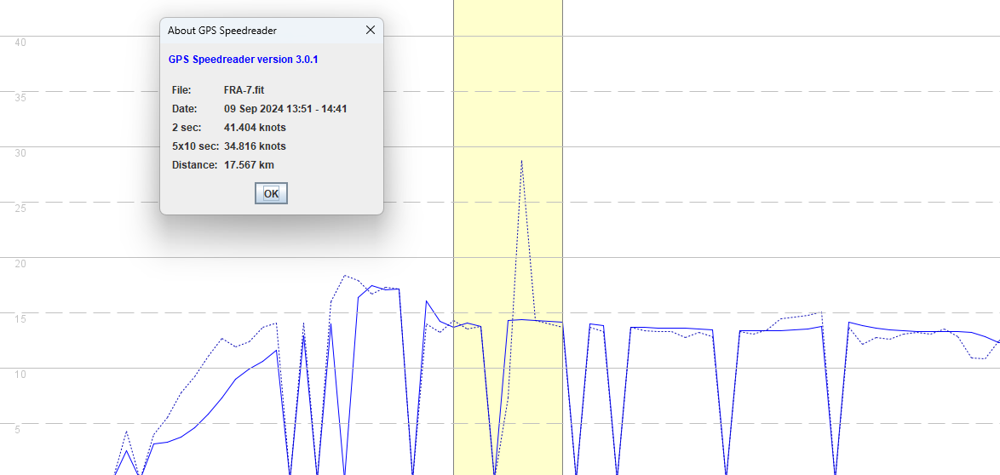
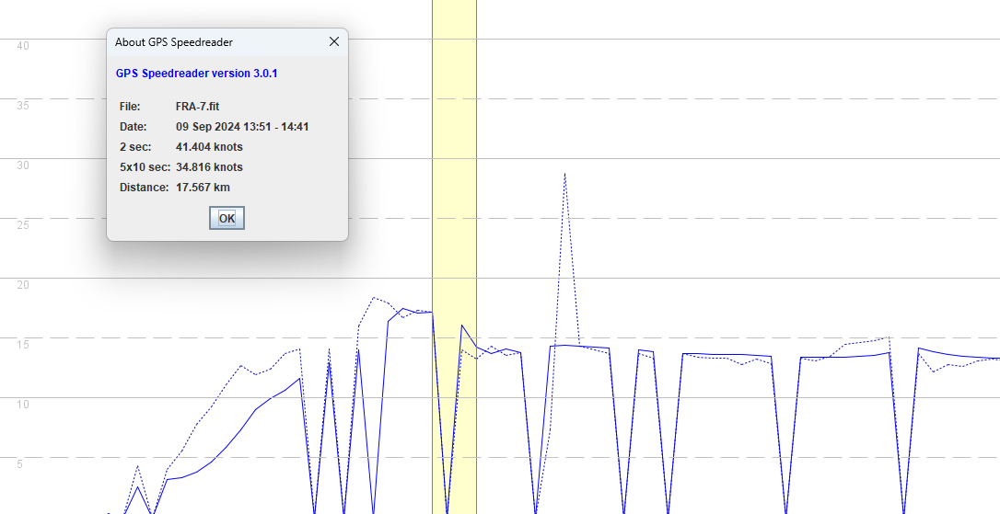
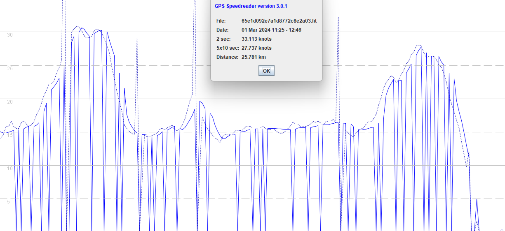

## Suunto Ambit3

Author: Michael George

Created: 11 Feb 2025

### Introduction

This is a very quick look at the data issue(s) affecting the Suunto Ambit3. The issue(s) were first mentioned in the GPS-Speedsurfing forum on 1 Feb 2022, and attributed to a recent software update by Suunto. Details can be found in the "[Suunto Probleem](https://gps-speedsurfing.com/default.aspx?mnu=forum&forum=1&val=182075)" thread.

Whilst it is possible to identify timing issues in Suunto files (missing speeds, early records, late records, missing records) this document is not advocating these fixes in any analysis software. The purpose of this document is simply to draw analogies with timing issues in some Garmin watches.

### Overview

The following screenshot serves as a good overview of the general data issues(s), since all of the files that have been examined contain similar artefacts.

Several issues are clearly evident in the screenshot.

- Speed (solid line) is often missing, but shown as zero in GPS Speedreader.
- Spikes in position-derived speeds (dotted line), due to timing issues. Records can be "early", or "late".
- Speed is typically lagging the position-derived speeds by 2 second, almost certainly due to filtering / smoothing.

### Devices

This brief investigation looks at 3 tracks from 3 different riders:

- Ambit3 Sport, windsurfing - 7 Aug 2023
- Ambit3 Sport, windsurfing - 1 Mar 2024
- Ambit3 Run, kitesurfing - 9 Sep 2024

The Suunto Ambit3 watches use the SiRFstar V, according to the technical specifications of the [Ambit3 Sport](https://www.suunto.com/en-gb/Support/Product-support/suunto_ambit3_sport/suunto_ambit3_sport/reference/technical-specifications/) and [Ambit3 Run](https://www.suunto.com/en-gb/Support/Product-support/suunto_ambit3_run/suunto_ambit3_run/reference/technical-specifications/).

All of the tracks contain exactly the same issues, which are clearly timing related and were introduced by Suunto in late 2021.

### Timing Issues

Four specific data quality issues are believed to be due to timing issues, caused by the Suunto firmware.

- Missing speeds
- Early records
- Late records
- Missing records

#### Missing Speeds

Examination of the FIT files clearly shows that some records are missing fields, except for latitude and longitude.

The missing fields include distance, vertical speed, horizontal speed, and altitude.

The easiest fix for missing fields such as speed and altitude is to use linear interpolation.

#### Early Records

The screenshot below illustrates "early" records and how they affect the position-derived speeds (dotted line).

The first "early" record is highlighted and the corresponding data is shown in the following table.

| # | Time | Speed  | Pos. Speed | Filter    | Comment |
| ---- | ------------ | ------ | ----- | ---- | ---- |
| 3027 | 12:16:24.000 | 16.737 | 18.93 |  |  |
| 3028 | 12:16:25.000 | **0.000** | 19.39 | V    | Missing speed |
| 3029 | 12:16:26.000 | 17.728 | 19.23 | A    |     |
| 3030 | 12:16:27.000 | 18.117 | 17.86 |      |      |
| 3031 | 12:16:28.000 | 18.058 | **31.44** |      | Position-derived speed is doubled |
| 3032 | 12:16:29.000 | **0.000** | **0.00** | -    | Dummy record |
| 3033 | 12:16:30.000 | 17.320 | **7.28** | T    | Position-derived speed is halved |
| 3034 | 12:16:31.000 | 16.678 | 14.65 |      |      |
| 3035 | 12:16:32.000 | 16.095 | 15.20 |      |      |
| 3036 | 12:16:33.000 | **0.000** | 15.68 | V    | Missing speed |
| 3037 | 12:16:34.000 | 15.784 | 16.92 | A |  |

The fields in 3031 are essentially "early" and belong to 3032. The easiest fix for this particular "early" record would be as follows:

1. Copy field values from 3031 to 3032. This includes latitude, longitude, and speed.
2. Use linear interpolation to calculate field values for 3031. This includes latitude, longitude, and speed.
3. Use linear interpolation to calculate any missing speeds, such as 3028 and 3036.

#### Late Records

The screenshot below illustrates the effect of "late" records and how they affect the position-derived speeds.

The "late" record is highlighted and the corresponding data is shown in the following table.

| #    | Time         | Speed  | Pos. Speed | Filter | Comment                           |
| ---- | ------------ | ------ | ---------- | ------ | --------------------------------- |
| 2670 | 14:35:33.000 | 13.704 | 14.35 |      |      |
| 2671 | 14:35:34.000 | 14.112 | 13.59 |      |      |
| 2672 | 14:35:35.000 | 13.821 | 13.80 |      |      |
| 2673 | 14:35:36.000 | **0.000** | **0.00** | -    | Dummy record |
| 2674 | 14:35:37.000 | 14.326 | **7.38** | T    | Position-derived speed is halved |
| 2675 | 14:35:38.000 | 14.404 | **28.82** |      | Position-derived speed is doubled |
| 2676 | 14:35:39.000 | 14.365 | 14.32 |      |      |
| 2677 | 14:35:40.000 | 14.229 | 14.05 |      |      |
| 2678 | 14:35:41.000 | 14.151 | 13.74 |      |      |

The fields in 2674 are essentially "late" and belong to 2673. The easiest fix for this particular "late" record would be as follows:

1. Copy field values from 2674 to 2673. This includes latitude, longitude, and speed.
2. Use linear interpolation to calculate field values for 2674. This includes latitude, longitude, and speed.

#### Missing Records

In addition to "early" and "late" records there are also a lot of missing records.

One of the missing records is highlighted and the corresponding data is shown in the following table.

| #    | Time         | Speed  | Pos. Speed | Filter | Comment                           |
| ---- | ------------ | ------ | ---------- | ------ | --------------------------------- |
| 2664 | 14:35:27.000 | 17.456 | 16.71 |      |      |
| 2665 | 14:35:28.000 | 17.086 | 17.37 |      |      |
| 2666 | 14:35:29.000 | 17.222 | 17.20 |      |      |
| 2667 | 14:35:30.000 | **0.000** | **0.00** | -    | Dummy record |
| 2668 | 14:35:31.000 | 16.134 | 14.00 | T    |      |
| 2669 | 14:35:32.000 | 14.248 | 13.28 |      |      |
| 2670 | 14:35:33.000 | 13.704 | 14.35 |      |      |

The easiest fix for missing records is to use linear interpolation for fields such as latitude, longitude, and speed.

### Filtering / Smoothing

The way that the speed data lags behind position-derived speeds is rather suspicious.

There appears to be a constant lag of 2 seconds, which usually indicates the speed is being filtered / smoothed. In most cases this behavior is also indicative of speeds being calculated from latitude and longitude, so not the Doppler-derived speeds.

### Discussion

This document shows the obvious data issues for the Suunto Ambit3 watches, most of which are related to timing issues.

It is perhaps worth considering the Suunto issues and how they relate to the timing issues on the Garmin Forerunner 255. Whereas Suunto drops entire records (or fields) when timing issues occur, Garmin persists the previous field values due to the design + implementation of their FIT writer.

Whilst it is possible to identify timing issues in Suunto files (missing speeds, early records, late records, missing records) this document is not advocating these fixes in any analysis software. The purpose of this document is simply to draw analogies with timing issues in some Garmin watches.

The early / late / missing issues discussed throughout this document are also evident in some Garmin FIT files, but the symptoms are slightly different. The FIT writer in Garmin watches persists field values in the absence of any updates, so the effects of timing issues are far less dramatic.

Taking a holistic view of timing issues in sports watches may prove to be beneficial.
