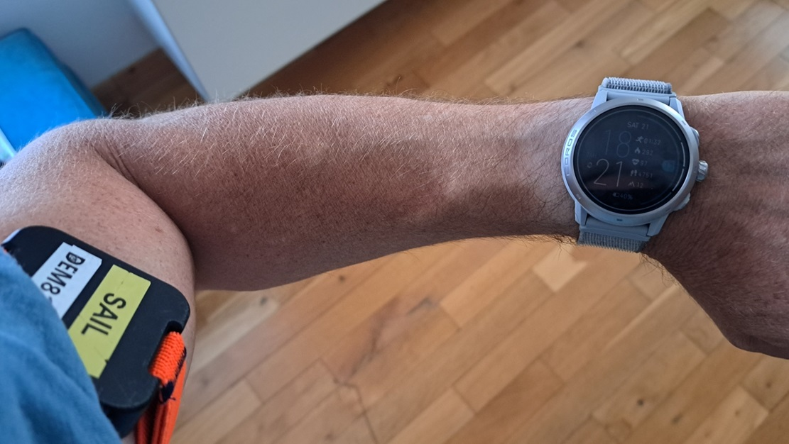

## Sampling Rates and Aliasing

Author: Michael George

Created: 22 Sep 2024

### Overview

This article describes some basic sampling theory; especially [sampling](https://en.wikipedia.org/wiki/Sampling_(signal_processing)) rates, [aliasing](https://en.wikipedia.org/wiki/Aliasing) and the [Nyquist-Shannon](https://en.wikipedia.org/wiki/Nyquist%E2%80%93Shannon_sampling_theorem) sampling theorem.

The following videos are very short, but nicely explain the basics:

- [Aliasing explained #VeritasiumContest](https://www.youtube.com/watch?v=CTllCx5pHvM) by Gergely Bencsik, duration 1:00 
- [What is aliasing and the Nyquist theorem?](https://www.youtube.com/watch?v=IZJQXlbm2dU) by AwesomeAcoustics in English, duration 3:28

I would recommend watching both of these videos if you are not familiar with the basic concept of aliasing.

The first video is only a minute long but is a great overview, whilst the the second video provides a few more details in just 3.5 minutes.

### Quick Demonstration

This simple demonstration uses data captured whilst on a [Beryl](https://beryl.cc/) bike. The [Motion GPS](https://www.motion-gps.com/) worn on the left arm (#815) was recording at 5 Hz.

Three GPS devices were worn on the right arm; Motion GPS #801 @ 1 Hz, Garmin Forerunner 255 @ 1 Hz, and Motion GPS #825 @ 5 Hz.

The left arm was holding the handlebars throughout, whilst the right arm was being swung forwards and backwards as if walking. The graph below shows the speeds that were recorded by the two Motions @ 5 Hz.

Motion #815 @ 5 Hz (red) was essentially recording the bike speed, whilst Motion #825 @ 5 Hz (blue) captured the speed of the right arm. It's quite impressive that GNSS technology can capture the dynamics so well. The arm speed is essentially the bike speed, plus or minus 3 knots.

The graph below clearly shows that Motion # 801 @ 1 Hz is affected by aliasing. The aliasing occurred because the frequency of the swinging arm exceeded the [Nyquist frequency](https://en.wikipedia.org/wiki/Nyquist_rate) of 0.5 Hz.

Note: The amplitude for Motion #801 is slightly greater than Motion #825 because it was being worn on the hand, whereas #801 was on the forearm.

It can also be seen that near-identical aliasing artefacts were present in data from the Forerunner 255 @ 1 Hz, shown in green:

### Why it Matters

GNSS chipsets typically determine speed using the observable [Doppler shift](https://en.wikipedia.org/wiki/Doppler_effect) for each of the satellite signals. This doppler shift is directly attributable to the relative motion of a specific satellite and the GNSS receiver. Through some clever math (and knowledge of the satellite positions and velocities) it is possible to determine the velocity of the receiver in 3D and 2D. The 2D speed is referred to as speed over ground (SOG) or [ground speed](https://en.wikipedia.org/wiki/Ground_speed).

GNSS receivers constantly track the individual satellite signals but in reality they are frequently re-assessing the doppler shifts, typically for periods of time lasting no more than a few tens of milliseconds. GNSS receivers therefore have the ability to calculate speeds which are near-instantaneous, which can be really useful but on the other hand they can capture movements that may be irrelevant, or simply due to measurement error.

The example below shows a single wingfoil run during from Weymouth Speed Week 2023 and it is easy to see in the 5 Hz data that "speeds" in excess of 31 knots are outliers. Whether the 31 and 32 knots were caused by sudden arm movements or measurement errors, they do not represent the actual board speed. When a GPS logger is recording at 1 Hz these anomalies need to be carefully considered, much akin to the issue of aliasing.

### Low-pass Filtering

When logging at 1 Hz you don't want to include anomalies due to sudden arm movements, or measurement errors. The cycling demonstration shows how a sampling rate that is too low can result in very misleading data. Similar principles also apply to speeds being recorded by a GPS logger and you don't want outliers or noise to be recorded as the actual board speed.

[Decimation](https://en.wikipedia.org/wiki/Downsampling_(signal_processing)) (aka downsampling) is the process of taking every Nth sample. For example, 10 Hz data downsampled to 1 Hz will retain 1 in 10 of the samples. The use of a [low-pass filter](https://en.wikipedia.org/wiki/Low-pass_filter) prior to decimation is often referred to as [anti-aliasing](https://en.wikipedia.org/wiki/Anti-aliasing) and in its simplest form may be a simple [moving average](https://en.wikipedia.org/wiki/Moving_average). Low-pass filters may be implemented within the GNSS chipset itself, or within the micro-controller that is logging the data, prior to decimation.

The graph below shows data from three devices on the same arm, during a short walk. The Motion @ 5 Hz (blue) captures the arm movements, Motion @1 Hz (red) clearly exhibits aliasing and COROS APEX 2 Pro (green, beta 3.0708) has clearly been through a low-pass filter. Whilst there is some variability in the COROS data it is clearly not recording the extreme speeds that were calculated prior to decimation.

### Summary

This is a very short article which aims to introduce the reader to concepts such as sampling rates and aliasing. The presence of aliasing or low-pass filtering is sometimes evident when testing GPS loggers.

Behaviors can vary for different firmware releases (especially COROS) and it can be useful to mention these within test results. Hopefully this article will be sufficient in explaining the basic concepts, without going in to excessive detail.

