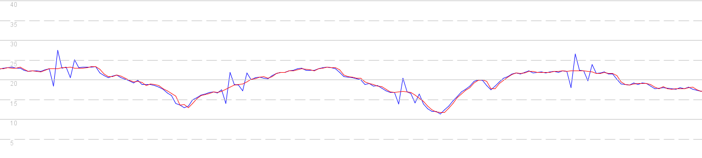
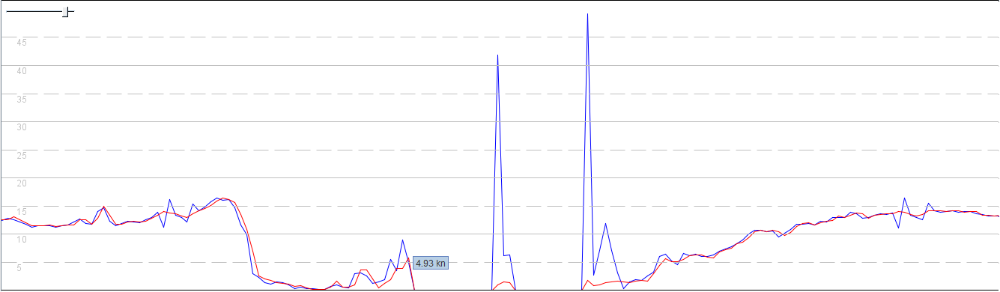

## Sailmon Observations

### Introduction

This document is a quick summary of my observations relating to the Sailmon Max. They have been documented as a favor to a friend who owns this device, so that my observations can be fed back to the developers. My main suggestion for Sailmon would be to include speed in the GPX export and ensure consistency between the CSV and GPX files.

This document will include some background about why the speed is so important, and the correct manner by which it can be included in GPX files. Later sections will discuss some additional observations and possible improvements / bug fixes.

### Speed Data

#### Doppler Derived Speed

I'd like to think that the developers at Sailmon are familiar with the inner workings of GPS / GNSS chipsets and how they use the Doppler [observable](https://gssc.esa.int/navipedia/index.php/GNSS_Basic_Observables) for the determination of velocity / speed over ground. However, I'll write a quick summary in this document and link to another page with further details, plus links to relevant papers on the subject.

GPS / GNSS receivers produce what is known as a PVT solution (position, velocity and time). It is common knowledge that with 4 or more satellites you can determine position in [ECEF](https://en.wikipedia.org/wiki/Earth-centered,_Earth-fixed_coordinate_system) coordinates (subsequently converted to latitude / longitude / altitude) and time, via [trilateration](https://en.wikipedia.org/wiki/Trilateration). What is less commonly known is that velocity (subsequently converted to course / speed over ground - COG / SOG) is calculated completely independently of position.

There are a number of [methods](https://insidegnss.com/wp-content/uploads/2018/01/marapr15-SOLUTIONS.pdf) by which velocity can be calculated by a GPS / GNSS receiver but by far the most common one uses the Doppler observable for each of the satellites in view. The Doppler approach is far more accurate than can be achieved by calculating velocity from latitude and longitude pairs. This is because the [Doppler](https://gssc.esa.int/navipedia/index.php/GNSS_Basic_Observables#Doppler_shift) observable is not subject to the majority of atmospheric errors affecting the [pseudorange](https://gssc.esa.int/navipedia/index.php/GNSS_Basic_Observables#Pseudorange) observable.

I'll link to a page that I wrote as part of a recent proposal for the GPX format - https://logiqx.github.io/gpx-ideas/proposal/speed.html

#### Sailmon Data

The following image shows a comparison of doppler derived speed (red) and position derived speed (blue) on the Sailmon Max. Both sets of data have been extracted from the CSV export provided by Sailmon.

You might be forgiven for thinking that the red line is just a smoothed version of the blue one, but that is not the case. They have both been calculated independently of one another and the benefits of the doppler derived speed (red) should be very clear.

The next graph shows how these differences are even more pronounced when the GPS / GNSS receiver loses its lock on the satellites. When the signal is lost after a crash, large spikes are evident in the position derived speeds (blue), but not the Doppler derived speeds (red).

Hopefully these two simple examples show how the Doppler derived speed is far superior to the positional derived speed. When using speeds from the Sailmon Max and posting to sites such as [gps-speedsurfing.com](https://www.gps-speedsurfing.com/) it is really important to use the Doppler derived speeds.

#### GPX Exports

Sailmon provides two formats for their data exports - CSV and GPX. The CSV format includes the Doppler derived speeds but the GPX file does not include the Doppler derived speed. It would be fantastic if Sailmon would include Doppler derived speeds in their GPX exports.

Firstly, a brief piece of history. Back in 2004 the GPX developers accidentally removed speed from the GPX 1.1 schema. It went unnoticed at the time and and ever since, GPX 1.1 files typically do not include any speeds, or include speeds using some non-standard approach.

There is however a legitimate way to include the speed data in GPX files, and pretty simple for Sailmon to implement. I documented a number of [approaches](https://logiqx.github.io/gps-wizard/gpx/speed.html) last year, but the ideal approach for Sailmon is Garmin's [TrackpointExtension](https://www8.garmin.com/xmlschemas/TrackPointExtensionv2.xsd) v2.

Sailmon currently uses [phpGPX](https://github.com/Sibyx/phpGPX) for their GPX exports, which provides support for Garmin's [TrackpointExtension](https://www8.garmin.com/xmlschemas/TrackPointExtensionv2.xsd) v1. A simple tweak to the phpGPX library to support [TrackpointExtension](https://www8.garmin.com/xmlschemas/TrackPointExtensionv2.xsd) v2 would allow speeds to be included in Sailmon GPX exports, plus other users of phpGPX.

