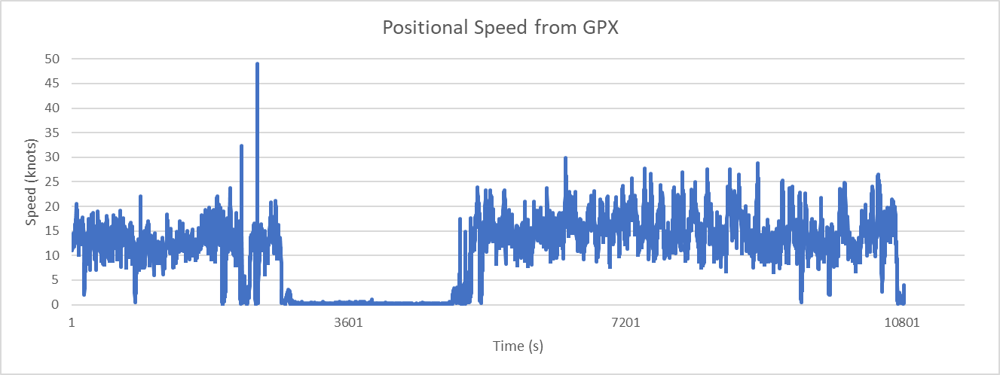
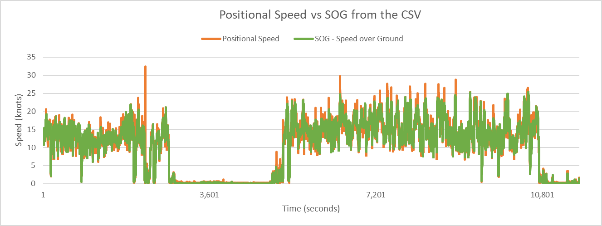
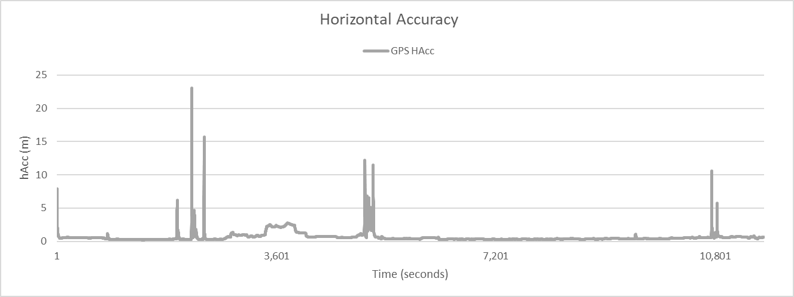
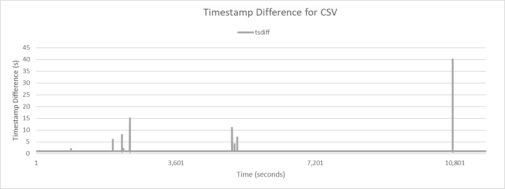
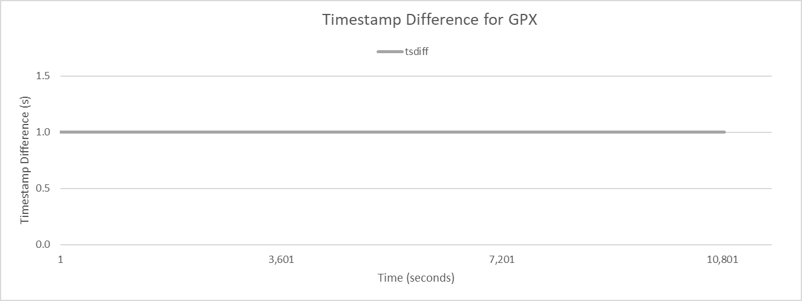

## Sailmon Observations

### Filtering

It is evident that some filtering is being applied to the data, differing slightly for the CSV and the GPX.

There are obviously reasons for the filtering being applied, but it is applied differently for the CSV and GPX data.

#### Comparison of CSV and GPX

The GPX file does not contain SOG, but speeds derived from positional data can be plotted:

Filtering is apparent in the CSV file (see below), most notably the absence of the 49 knot spike in the positional speed. There is also an absence of the lesser spikes, such as after crashes during the session and when the session was resumed after a 20 minute break.

Conversely, filtering is sometimes observed within the GPX data but not in the CSV data, perhaps during periods of inactivity?

#### Horizontal Accuracy

It would appear that horizontal accuracy estimate (hAcc) is being used as one of the filter criteria for the CSV file, but not the GPX file.

#### Timestamps

One of the tells is the discontinuity in the timestamps of the CSV file and how these occurrences correlate with increase values of hAcc.

There is never any discontinuity in the timestamps of the GPX file, despite filtering also being applied. This is covered in a separate [document](timestamps.md).

#### Wrap Up

There are obviously reasons for the filtering being applied, but it is applied differently for the CSV and GPX data. Perhaps it should be applied consistently?

Fixing the timestamps in the GPX file would definitely be beneficial.
