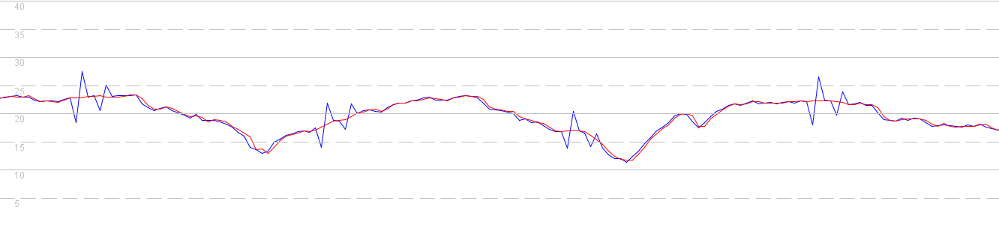
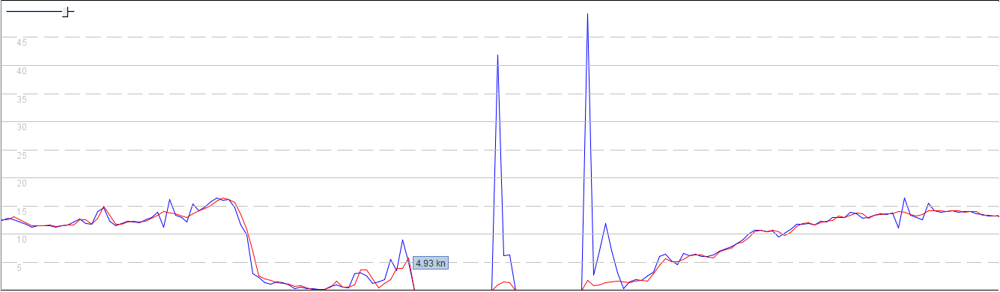

## Sailmon Observations

### Speed Data

#### Background

I'd like to think that the developers at Sailmon are familiar with the inner workings of GPS / GNSS chipsets and how they typically use the Doppler [observable](https://gssc.esa.int/navipedia/index.php/GNSS_Basic_Observables) to determine velocity / speed over ground. However, I'll write a quick summary in this document and link to another page with further details about speed, which includes links to some papers on the subject.

GPS / GNSS receivers are all able to produce a PVT solution (position, velocity and time). It is common knowledge that with 4 or more satellites you can determine a position in [ECEF](https://en.wikipedia.org/wiki/Earth-centered,_Earth-fixed_coordinate_system) (subsequently converted to latitude / longitude / altitude) and time via [trilateration](https://en.wikipedia.org/wiki/Trilateration). What is less well known is that velocity (subsequently converted to speed + course over ground - SOG + COG) is calculated completely independently of position.

There are a number of [methods](https://insidegnss.com/wp-content/uploads/2018/01/marapr15-SOLUTIONS.pdf) by which velocity can be calculated by a GPS / GNSS receiver but by far the most common one uses the Doppler observable for each of the satellites in view. The Doppler approach is far more accurate than simply calculating velocity from changes in latitude and longitude. This is because the [Doppler](https://gssc.esa.int/navipedia/index.php/GNSS_Basic_Observables#Doppler_shift) observable is not susceptible to atmospheric conditions affecting the [pseudorange](https://gssc.esa.int/navipedia/index.php/GNSS_Basic_Observables#Pseudorange) observable.

I'll link to another page with more information, written as part of a recent proposal for the GPX format - [Doppler-derived Speed](https://logiqx.github.io/gpx-ideas/proposal/speed.html).

#### Sailmon Data

The following image shows a comparison of doppler derived speed (red) and position derived speed (blue) from the Sailmon Max. Both sets of data have been extracted from a CSV export from the Sailmon Max.

You might be forgiven for thinking that the red line is just a smoothed version of the blue one, but that is not the case. They have been calculated independently of one another and the benefits of the doppler derived speed (red) should be immediately apparent.

The next graph shows how these differences can be even more pronounced when the GPS / GNSS receiver loses its lock on the satellites. When the signal is lost or impaired, large spikes are often evident in the position derived speeds (blue), but not the Doppler derived speeds (red).

Hopefully these two simple examples show how the Doppler derived speed is far superior to the positional derived speed. When using speeds from the Sailmon Max and posting to sites such as [gps-speedsurfing.com](https://www.gps-speedsurfing.com/) it is really important to have the actual speeds calculated by the GPS / GNSS receiver.

#### GPX Exports

Sailmon provides two formats for their data exports - CSV and GPX. The CSV format includes the Doppler derived speeds but the GPX file only includes the positional data. It would be extremely beneficial if Sailmon could include Doppler derived speeds in their GPX exports.

Firstly, a brief piece of history. Back in 2004 the GPX developers accidentally removed speed from the GPX 1.1 schema. It went unnoticed at the time and and ever since, GPX 1.1 files typically don't include any speeds, or sometimes include speeds using non-standard approaches.

There is however a legitimate way to include the speeds in GPX 1.1 files, and relatively simple for Sailmon to implement. I documented a number of general [approaches](https://logiqx.github.io/gps-wizard/gpx/speed.html) last year, but the easiest / best option for Sailmon is using Garmin's [TrackpointExtension](https://www8.garmin.com/xmlschemas/TrackPointExtensionv2.xsd) v2.

Sailmon currently uses [phpGPX](https://github.com/Sibyx/phpGPX) for their GPX exports, which provides full support for Garmin's TrackpointExtension v1 and v2. The commit history on GitHub shows full support for TrackpointExtension v2 was added in [2017](https://github.com/Sibyx/phpGPX/commit/bc6e2578b4f1fd94f0f231b8d6a9ab315b3394ee).

It should be a simple matter to include speeds in Sailmon GPX 1.1 files, using the existing features of phpGPX. Since GPX is the most widely used file type for the analysis of GPS / GNSS data this would be of great benefit to windsurfers, windfoilers and wingfoilers who own the Sailmon Max.
