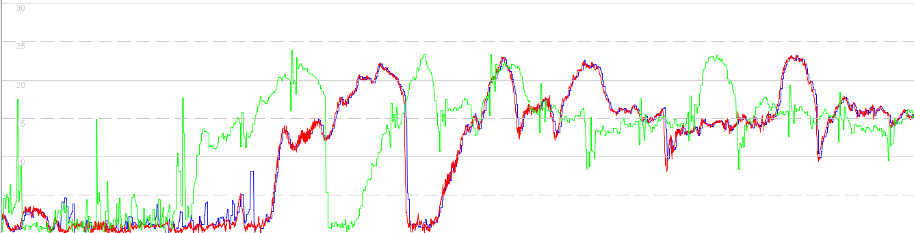

## Sailmon Observations

### Timestamps

The image below is a comparison of the CSV export (blue), GPX export (green) and data from a u-blox logger (red).

Ignoring the "noisy" nature of the position derived speeds in the GPX file (green) it can be seen the data in 3 files is properly aligned:

However, later in that same session it can be seen that data in the GPX file (green) appears to be "earlier" than the CSV (blue) and the u-blox logger (red). 

The timestamps in the GPX file are always contiguous, 1 second apart. There are no places in the GPX file where the difference is not 1 second, despite there being evidence of some filtering.

Closer inspection of the data shows that there are periods present in the CSV that are not present in the GPX. Whilst there may be reasons for removing data from the GPX file, timestamps for the remaining data should be unaffected.

The GPX format allows for non-contiguous data in a track through the use of multiple `<trkseg>` elements.
